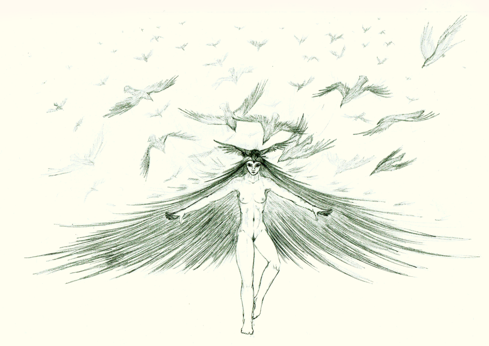

# Queen of Ravens

**Demographics:**: Elder Ael'fae (Female) – Immortal Shapeshifter

**History**:

Originally a member of the first Ael'fae. Learned to shapeshift into multiple creatures at once. As a side effect of this skillset, developed advanced skills in animancy and became effectively immortal.
Since this time has worked to expand her consciousness, knowledge, and net biomass.
She is commonly abreast of current global politics, especially wars and lesser conflicts, but rarely gets personally involved.

**Skills and Abilities**:

As of this writing, the Queen of Ravens has become a communal mind, consisting primarily of an immense flock of ravens. Due to the limitations of raven minds, often maintains one or more human forms to hold the bulk of her 
consciousness. When in human form, appears as a dark-haired, pale skinned, nude woman of indeterminate age. Individual human forms serve more as avatars of the consciousness than actual autonomous entities. If one is killed, 
this has little impact on the swarm.
The Queen's Ravens are spread throughout the known world, primarily on the continent Eaos. This gives her an unparralelled knowledge of world events.
In the rare case that she or part of her swarm is engaged in combat, she is capable of rapidly and regularily shifting between ravens and human forms. She can transmute human flesh into organic sludge on touch. Occasionally 
transmutes a razor sharp sword made shapeshfted bone. Can also shift into swarms of Dermestidae beetles, carrion flies, maggots, and other creatures. Has basic skill in bioengineering magical plagues.
Over the millenia, the Queen of Ravens has lost most of her human manerisms. When she does appear in human form, she seems rather alien.

**Alliances**:

The Queen of Ravens generally does not involve herself in local affairs or related politics. However, she is a member of the Elder Council, acting primarily in an information gathering role.

**Location**:

While her ravens are spread across most of the known world, she mantains a base grown from an immense oak tree in the eastern reaches of the Mhidda continent. Among other things (including the last vestiges of her original life), 
this tree contains most of the knowledge she has accumulated, as well as roosts and breeding grounds for her ravens.