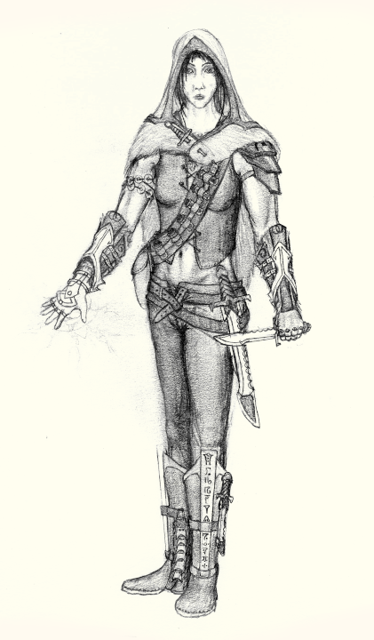

# Wysteria

**Name:** Wysteria
**Demographics:** Mixed-blood Æl'xhal/Æl'daal; Riftlander
**Born**: 30 AC

**Appearance:** 

**Affiliations:** 

## Personality

First and foremost, Wysteria has an unquenchable love for adventure. This has led her to an oft-solitary life, as she refuses to compromise on her chosen lifestyle and 
has difficulty finding like minded individuals who can keep up.

While Wysteria is not especially knowledgeble about the wider world, she is quite smart. In particular, she is good at planning and thinks quickly under pressure.
She tends to be driven - once she puts her mind to something she'll get it done - but also pragmatic, and has no illusions about the danger of her line of work.
Despite this, she is remarkably sincire, and finds constant joy in the beauty of the world.

The danger of her adventures and her otherwise solitary nature leads her to let loose somewhat when she does travel to more populated lands, though even then she likes to keep her head clear, 
and generally avoids drugs and alcohol, seeking instead the pleasure of good company. Later in life, after she's managed to gather a group of like minded individuals, she mellows out a little and seeks more singular company. 

## Skills

Very athletic, excelent balance and coordination, fairly strong. Exceptional rock-climber.

Has picked up a collection of other random skills over the years, travelling up and down the free cities - a decent shiphand, knows enough sleight-of-hand to win at dice more often than she loses, 
a decent card-player, some experience in smuggling, and a remarkably good judge of character.

Has some magical talent, though not a lot.
Most skilled in sensing the flow of arcana, which she most often uses to sniff out artifacts and avoid hazards.
Some encantation and channelling skills, most notably teleportation.
Most unique skill is a particular talent for consistent spellcasting in chaotic environments like the riftscape.

## Biography

Her Father is a 'daal battlemage in the Uon war who retired to a settlement at the edge of the riftlands, and made a liveleyhood selling Uon artifacts from the riftlands.
Mother was a 'xhal hunter displaced by the war. Both would make frequent expeditions into the rift to reclaim artifacts, and Wysteria followed in the family trade.

Wysteria followed allong on riftland expeditions with her parents from her early teens.
In her late teens, Wysteria began running goods to the AoMMA to sell some of the more unique artifacts to the researches and mages there, while her father remained at home to run the shop.
These expeditions were usually coupled with a season of ad-hoc classes at the Academy, which helped to hone her magical skills. During this time, Wysteria discovered a particular gift for teleportation.
<Note: Trip from Rift Overlook to AoMMA is about 2 mths by boat>

By her early twenties, Wysteria was running solo expeditions into the riftlands, parents mostly retired from running expeditions.
Still occasionally to ran goods to AoMMA, but spent less time there when she did go - generally half the year in the riftland, and half the year running goods to the Free Cities, and/or the AoMMA, 
which only allowd for a few weeks there. Some years, would only travel as far upriver as Kenford instead of taking the full trip to AoMMA.

Met <artificier mage> in his 2nd year at Academy, in 52 AC. They bonded over a mutual interest in magical artifacts, and <artificier> made Wisteria a set of feather-fall greaves.
In the intervening time between Wysterias next Academy visit, <artificier> made Wysteria's gauntlet, with the promise of an interesting artifact when she next visited.

Wysteria found an especially powerful Uon spear in 55 AC, and started taking on more varied work - still mostly artifact retrieval, but more often specific artifacts for wealthy clients, and no longer just in the riftlands.
<Artificier> joined in on a couple of the more tame ones (and did eventually go on a couple expeditions in the riftlands) 

Eventually started to gather a team of like-minded adventurers to take on more challenging expediditions.

Died 87 AC to a particularly deadly ruin in the Southwest Eaos Desert.