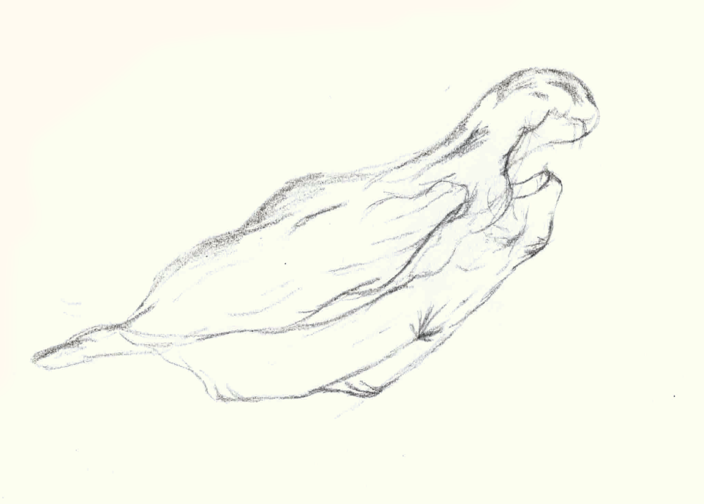
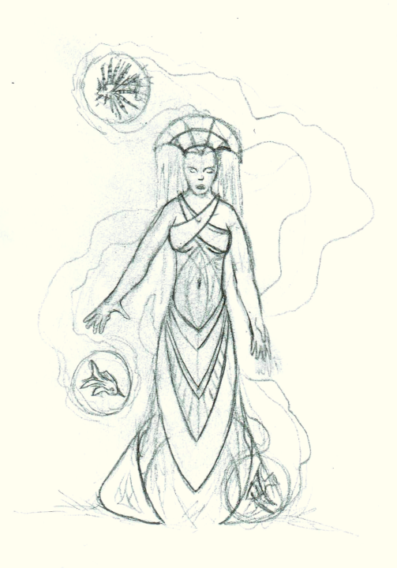

# Ael'jinn

<h2 id="highjinn">High jinn</h2>

**Name:** Enthu, the Eternal

**Demographics:** Agender Eldar 'Daal

**Description:** 

Dark, brown-grey skin, bald, and androgynous. Indeterminate Age. 
Mineral veins show through their few wrinkles. Nails appear to be made of polished gold. Looks otherwise human, though their skin is hard as stone to the touch.

(One of) the only founders to remain an active leader of the 'jinn through their entire history. Currently resides in New Aelmos as the nominal monarch of all 'jinn.
Patron of Earth.

**Affiliations:** 

----------------

**Name:** Weth, the Bounteous

**Demographics:** Male Eldar 'Daal

**Description:** 
Born 2987 BC, in Old Aelmos

Typically maintains the form of a muscular, dark-skinned male 'daal, much the same as how he appeared at 35.
Barechested, with waist-wrap of blue silk and copious jewelry of bronze and other materials.

Origionally a weather-mage, more skilled in elementalism than shapeshifting. Already a skilled mage during the exodus from Aelmos, and helped ensure their success. Eldest of the four patrons, and the most prolific.
Patron of water. Parent of Talsar.

In the current age, nominal overseer of the 'jinn principalities agriculture and climate, although in practice others run the day-to-day operations, he mostly only intervenes during crises.
Normally, he spends time travelling between cities to attend various high-society events, and mentoring younger 'jinn. Still quite attached to earthly pleasures - food, sex, etc., unusually so for an Eldar.

Retains immense talent in weather and water magic from his youth. Now also skilled in healing magic, and various forms of transmutation (although still not especially skilled in shapeshifting).
 

**Affiliations:** 

----------------

**Name:** The Stoneshaper

**Demographics:** Male Earth 'jinn / Chimeric Shapeshifter

**Description:** 

Normally appears as a 9 foot tall centaur chimera formed from sandstone or marble, with a humanoid torso, and the heads of mythical beasts at the base of his torso.
Other times, takes the form of a sandworm, with a humanoid torso in place of a tongue.
Unique among chimeric shapeshifters in that he is just as adept at shaping limbs from stone as from flesh, or converting between the two.
Also unusually capable at changing his size, mostly because spare stone is a lot easier to acquire than spare flesh.

One of the few non-Dragons who can and does use petrification magic.

Was a protoge of the shaper of new Aelmos, some hundred years after the founding of the city.

**Affiliations:** 

----------------

<h2 id="modernjinn">Contemporary 'jinn</h4>

**Name:**

**Demographics:** M Celestial 'jinn

**Description:** 

Powerfull psychometry seer. Supplemental skills in sympathy and restoration - can magically reform ancient ruins.

Descendant of Enthu

**Affiliations:** 

----------------

**Name:** Dawn

**Demographics:** Female Air 'jinn

**Description:** 

Invisible body (comprised of tighly-controlled air) with hair like cumulous clouds, lit by an inner radience
Often wears a thin white gown.

Grandaughter of Typhoon.

**Affiliations:** 

----------------

**Name:** Aurora

**Demographics:** Female Water 'jinn

**Description:** 

Hair consists of precisely shaped ice shards that precisely refract light, shading them with a brilliant array of colors
Body is a mix of water and more ice shards. 

**Affiliations:** 

----------------

**Name:** Neptune

**Demographics:** Male Water 'jinn

**Description:** 

Lives in Sea's Bounty and rarely leaves the ocean. When above-water, looks like the crest of the breaking wave. When underwater, nearly invisible. 

**Affiliations:** 

----------------

**Name:** Michael

**Demographics:** Male Earth 'jinn

**Description:** 

Body consists of white marble veined with raw gold. Has perfectly-rendered hair and beard of pure gold.

**Affiliations:** 

----------------

**Name:** Waterfall

**Demographics:** Agender hybrid (Earth/Water/Air) 'jinn

**Description:** 

Ancient. Appears as a collection of floating rocks pouring water. Not discernably humanoid.

**Affiliations:** 

----------------

**Name:** Shoal

**Demographics:** Female Water 'jinn

**Description:** 

360 years old, with a body fully comprised of water.
Usually acompanied by two or three levitating spheres of water, each containing a different live tropical fish.
Body also often contains some number of fish. Also wears fine silks, color coordinated with the fish of the day.

"High-society" jinn. Maintains homes in New Aelmos, Sea's Bounty, and the City in the Clouds. Travels among the various 'jinn cities frequently, generally going wherever events of note are happening.

**Affiliations:** 

----------------

**Name:** Umbra

**Demographics:** Female Celestial 'jinn

**Description:** 

Celestial jinn with a body of stars and shadow.
Usually wears a robe of grey, black, and purple, with bronze ornamentation.
Carries a trio of small blades tied to the end of purple silk tassels.

270 years old. Has been the lead spymaster of the Ael'jinn military for the past 150 years.
Strong proponent of raising the celestial 'jinn to the same level of social recognition and political power as the four main families.

**Affiliations:** 

----------------

**Name:** Arctis

**Demographics:** F Water 'jinn

**Description:** 

Skin of water, hair of frost

**Affiliations:** 

----------------

**Name:** Gemini

**Demographics:** F Water 'jinn

**Description:** 

Water mimic, trickster.

**Affiliations:** 

----------------

**Name:** Pyrite

**Demographics:** F Earth 'jinn

**Description:** 

Polished granite skin. Rough quartz and raw gold hair an nails.

**Affiliations:** 

----------------

**Name:** Typhoon

**Demographics:** Male Air 'jinn 

**Description:** 

Hair and beard appears to be comprised of white clouds.
The rest of his body is a pillar of stormclouds, with no discernable arms.

Wears a White cloak that turns to cloud at its edges, and a tassled belt.
Carries four broad-tipped scimitars, which he levitates when wielding them.

**Affiliations:** 

----------------

**Name:** Kaohi

**Demographics:** Female Fire / Earth 'jinn

**Description:** 

Face is sculped marble. Body is pure fire, but tightly controlled.
Hands are encased in segmented basalt.

Typically wears a red robe enchanted to be be fireproof, bronze jewelry, and wields a Katana.
Grandaughter of Uriel.

**Affiliations:** 

----------------

**Name:** Uriel

**Demographics:** Male Fire 'jinn

**Description:** 

Body of pure fire, with a large pair of flaming wings.
Torso ends in a long tail of fire instead of legs

Wears a bronze chestplate sculpted to look like a muscular torso, a blue and gold shoulder-wrap, a white robe, and a golden halo.
Wields a two-pointed spear with an ever-burning flame in its center.

**Affiliations:** 

----------------

**Name:**

**Demographics:** Female Fire 'jinn / Water 'jinn (Fire dominant)

**Description:** 
Twin of ... v

**Affiliations:** 

----------------

**Name:**

**Demographics:** Female Fire 'jinn / Water 'jinn (Water dominant)

**Description:** 
Twin of ... ^

**Affiliations:** 

----------------

**Name:** Dervish

**Demographics:** Female Fire 'jinn

**Description:** 

Young but talented Fire jinn.
Lower half is usually a vortex of flame.
Head and upper torso is that of an olive-skinned Ael. 
Hair also consists of flame.

Can transform entirely into a flame vortex, and move quite rapidly in this form.
Does not yet have the ability to transport objects, or clothing in this vortex form, so often goes around clad in nothing but her flames.
Will sometimes wear a gold and ruby torc and matching bracers.

**Affiliations:** 

----------------

**Name:** Unknown

**Demographics:** Female Earth jinn

**Description:** 

Skin of blue-veined marble. Eyes, nails, teeth, and interior all consist of amethyst.

**Affiliations:** 

----------------

**Name:** Karsa

**Demographics:** Androgyne Earth 'jinn

**Description:** 

Skin of white quartz / granite, with striations that vary day by day - darker stone, gold, etc. Teeth an nails usually match this secondary material.
Hair of amythyst. About 800 years old.

Mapmaker. Shapes intricate 3D maps out of stone - cities, countries, etc.
Each one is a practical work of art, and fetch a high price across the continent.

Born in the Hollow Cities, but now lives in New Aelmos. Often travels with mercantile delegations to other parts of Eaos-Mhidda - Eaosport, Arcmuth, the Hollow Cities - sometimes the Sachean Isles, or even the Dhaigean Isles

**Affiliations:** 

----------------

<h2 id="halfjinn">Dai'jinn</h4>

**Name:** Mira

**Demographics:** Female Ael'daal / Fire dai'jinn

**Description:** 

Red hair, which catches fire when she feels strong emotions. Generally poor control over her abilities

Raised by a single mother (Ael'daal). Lost control of her 'jinn powers in her early teens, accidently burning down her home and killing her mother.

Wears a fairly skimpy outfit of (fireproof) salamandar leather and dragonhide, and carries a singed oaken staff. Also has a melted metal necklace, her only memento from her youth.

**Affiliations:** 

----------------

**Name:**

**Demographics:** Male Fire dai'jinn

**Description:** 
Short black hair, with a moustache and goatee. Olive skin, orange eyes.
Mostly skilled at fire evocation, poor transmutation skills.

Scoundrel and wanderer, with a firey temper.

Father of Mira

**Affiliations:** 

----------------

**Name:**

**Demographics:** Female Ester's Lineage 'jinn / Chimeric shapeshifter

**Description:** 

In her most personable shape, looks like an olive-skinned Aeldar of indeterminate lineage.
Opaque black ooze covers her body from collarbones to the ground, miming the form of a black dress, and extending into the ground itself, innundating the earth and filling cracks between stone.
In this manner, she carries quite a bit of biomass with her, like most chimeric shapeshifters, albiet in a concealed way.
This guise does not really work well far to the north, where the ground is impermeable due to permafrost, or in any other locations covered in an impenetrable surface.

Her specuialty is shaping disconected body parts out of her ooze - eyes, teeth, tentacles, etc.
She can also spread her body over fairly large areas - up to a couple kilometers in diameter - in order to keep an eye or an ear on things. However, she is not a full multiform shapeshifter. 

A little over 200 years old.

**Affiliations:** 

----------------
