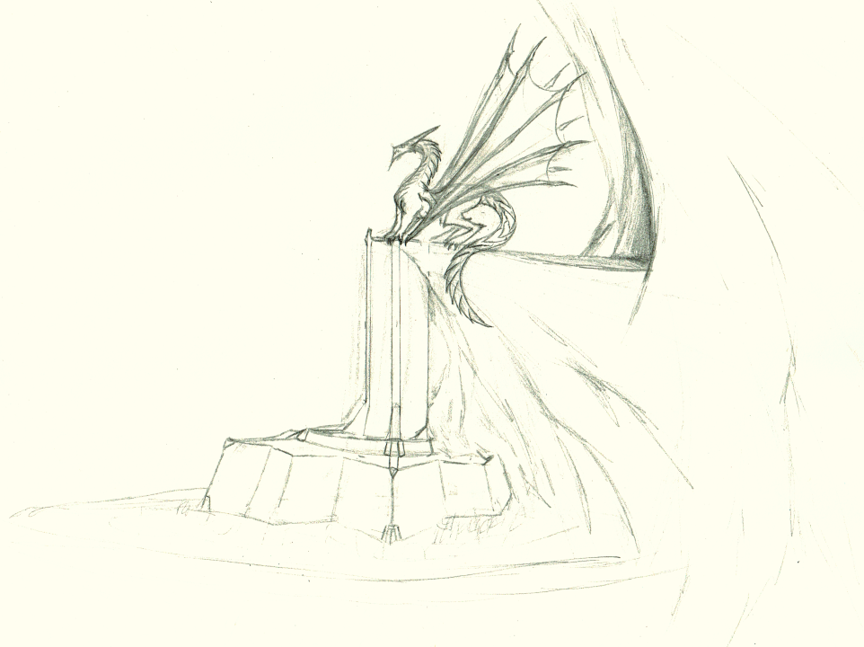
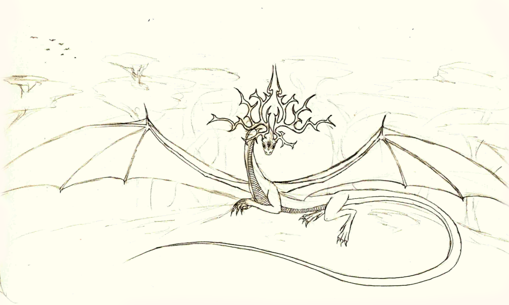
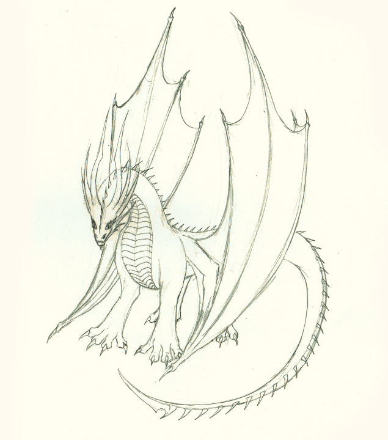
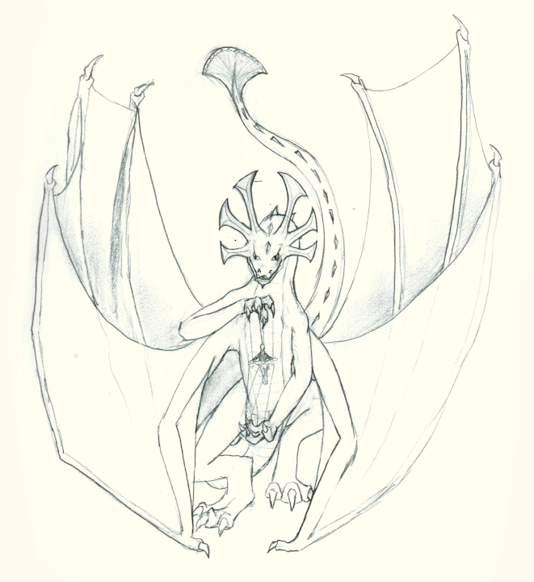
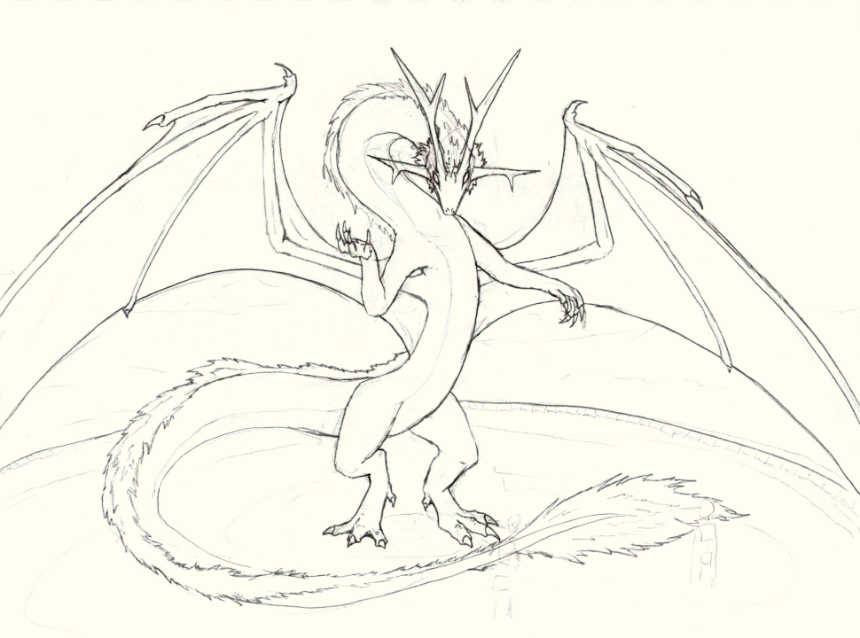
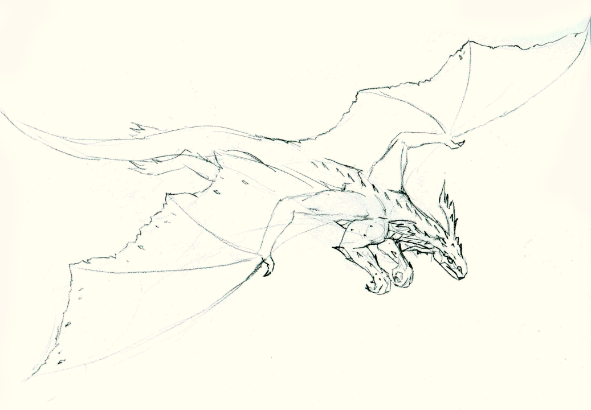

# Dragons

**Name:** Ironfire; Lord of Dragonspire Citadel

**Demographics:** Male Plated Dragon

**Description:** Dark orange scales, with a lighter underbelly and dark grey back. Bulbous tail, long wingtip claws and jaw spine. Red eyes.

6,200 years old. Fought on the side of the Ael during the Dragon war, and again during the Uon war.
Hoarder of Minerals - mostly gold, silver and gemstones. Master of Dragonspire Citadel. Lends his fire to the forges in return for a tithe of the mines.

Exceptionally potent fire magic, capable of reaching temperatures in excess of 2000 C.

**Affiliations:** Dragonspire Citadel, Hollow Mountain

----------------

**Name:** Queen of the Valley

**Demographics:** Female Western Dragon

**Description:** Gold and green scales. Exceptionally large and ornate antler-like horns

Watches over a large valley, and discourages human exploitation and settlement.
An elemental shapeshifter, has transformed herself into an artificial dryad of the valley.
One of the eldest extant dragons, at about 50,000 (perhaps much older - 200 - 300 mill?) years old, predating the arrival of Ael on Quon Xi. Exceptionally wise and powerfull. Mostly ignores events external to the valley.

----------------

**Name:** Unknown

**Demographics:** Male Spined Dragon

**Description:** Nested pairs of curved horns.

Hoarder of Knowledge, especially arcane knowledge, as well as some magical artefacts. Has an extensive library. Particularly skilled in magic, notably: 
Sorcery (Fire, Lightning), Scrying (Future Sight, Premonition, Psychometry, Farsight, Object Finding), Encantation (Spell redirection and cancellation).

Despite being a dragon, is the youngest (and weakest) member of the Elder council, at approx 1,200 yrs.

**Affiliations:** Elder Council

----------------

**Name:** Unknown

**Demographics:** Female Horned Dragon, Shapeshifter

**Description:** Silvery scales, with a paler back and bluer underside. Bright purple eyes. Narrow horns.

Hoarder of Power – Rather unique, as she has an almost entirely ephemeral horde. Collects political favours. Holds some high rank in almost all nations. A skilled shapeshifter, with many aliases across various peoples. 
Also a potent telepath.

**Affiliations:** Elder Council, most nations and religions

----------------

**Name:**

**Demographics:** Male Tundra Dragon, Shapeshifter.

**Description:** 

In human form: Stark white hair, pale skin, ice-blue eyes. Faint scale pattern at his temples 
White-dyed armor of horizontal leather strips, white cloak trimmed with silver fur, carries a claymore of ancient design.

Approx 5,600 years old. Fought with against the Ael in Ael-Dragon war.
Some time afterwards, took human form, and sought out challenges. Spent time as the leader of various large Midh clan in the past.
More recently, mostly fights monsters and bandits. Has slain at least one dragon while in human form.
Fought with the Ael' in the Uon war.

Inspired many legends.

Hoards victories. Keeps a trophy from each worthy foe he has bested.

**Affiliations:** 

----------------

**Name:** Atrefax Goldcrest

**Demographics:** Male Spined Dragon

**Description:** 
Feathered spine. Head surrounded by a fan of golden horns with broad tips.

5,000 years old. Rules over one of the handful of 'xhal settlements who retained alliance with dragons after the Dragon Empire crumbled, in eastern Kita Lau.
Supplemented by offering from settlement
Once a year, claims the fairest member of the settlement as an offering. While they are never seen again, and most thinks he eats them, actually keeps them as servants.

Lives in a cave system under the flooded caldera of a dormant volcano.

**Affiliations:** 

Xeres Empire (Formerly)

----------------

**Name:** ____ Whitescale

**Demographics:** Tundra Dragon

**Description:** 

Young tundra dragon - between 300 and 500 years living on the westernmost of the Dragon Teeth isles.
Symbiotic relation with the selkies of the isle - feats on carcasses of the island-whales and other great sea-creatures they hunt, and in return gifts them some pittances from hoard.

Extremely athletic, and often travels the 1000 km between the isles and northern Quon Xi to raid, typically spending about a week away from the isle.

**Affiliations:** 
Whitescale Selkies

----------------

**Name:** Xeres Suncrowned

**Demographics:** M Spined Dragon

**Description:** 

Born 5600 BC.

Xeres was at the forefront at the Dragon War in Xuon, and lead the negotiations with the Ael'Xhal. Claimed a fertile valley, already well-populated with Ael, as his territory and claimed tribute from them.
Initially, Xeres and his allies only claimed a moderate portion of Xeres, with the dragons of other regions making their own negotiations.

After the dragon war, Xeres involved himself in inter-Dragon politics on Xuon, convincing the other dragons of the continent to allow the Ael of his empire into their territory, in return for tribute from these new inhabitants.
In this way, the Xeres empire expanded across all of Xuon.

This empire-building gave Xeres a great deal of social and political power among dragonkind, especially on and around Xuon.
Over the course of his reign, Xeres sired eleven children, most by different mothers, an almost unheard of number for a dragon.

Xeres died alongside his empire in 2400 BC, during the Uon invasion of Xuon. 

**Affiliations:**

Xeres Empire

----------------

**Name:**

**Demographics:** F Spined Dragon

**Description:** 
Born 5600 BC.

Founded Dragonhalls, along with Eleoth.

Died 1500 BC, defending Dragonhalls from the Uon collective and rebuffing their incusion into Kita Lau.

**Affiliations:** 
Dragonhalls

----------------

**Name:** Eleoth Aspenscale

**Demographics:** M Western Dragon

**Description:** 
Born 5500 BC

Descendant (4 generations removed) of the Queen of the Valley.

Founded Dragonhalls, along with ...

Died 90 BC, fighting alongside the Eaos Ael alliance against the Uon.

**Affiliations:** 
Dragonhalls

----------------

**Name:** Melias Abacaxi

**Demographics:** M Spined Dragon

**Description:**
Born 4900 BC

First child of the Dragonhalls founders.
Left Dragnhalls around 4000 BC to find his own way in the world

**Affiliations:** 
Dragonhalls (formerly)

----------------

**Name:** Turi Skyflower

**Demographics:** F Western Dragon

**Description:** 
Teal-green scales, Yellow-orange feathers.

Born 4200 BC

Second child of the Dragonhalls founders, and the current leader of Dragonhalls.

**Affiliations:** 
Dragonhalls

----------------

**Name:**

**Demographics:** M Western Dragon

**Description:** 
Born 5000 BC, somewhere on mainland Quon Xi. 
Joined Dragonhalls around 2000 BC
Current mate of the leader of Dragonhalls, and father to the Twins.

**Affiliations:** 
Dragonhalls

----------------

**Name:** Hakara Dawnfeather

**Demographics:** M Western Dragon

**Description:** 
Born 3100 BC.
Third (and final) child of the Dragonhalls founders
Father of Feathermail.

**Affiliations:** 
Dragonhalls

----------------

**Name:** __ Silverscale

**Demographics:** Female Plated Dragon

**Description:** 

Daughter of Lord Ironfire. 
Born 3700 BC. Grew up around humans, in Ironfire citadel.
Started travelling outside the city at 200, and had quite an adventurous few years.

Settled down in Dragonhalls in 2600, shortly before the start if the conflict between the Uon and Xhal.
Mother of Feathermail.

**Affiliations:** 
Dragonhalls

----------------

**Name:** ___ Feathermail

**Demographics:** F Western/Plated Dragon

**Description:** 
Unusual appearance, looking like a combination between a western and plated dragon.
Back is covered in a series of blue-grey plates, each tipped with orange-feathered ruffs.

Born 1900 BC. Granddaughter of Ironfire.

Very adventurous in her youth. Still has a mischevious streak.
Quite friendly with the humans of Dragonhalls

Considers Dragonhalls her home, and shares a lair there with her parents

**Affiliations:** 
Dragonhalls, Ironfire Citadel

----------------

**Name:** ___ Carvedscale

**Demographics:** Male Spined Dragon

**Description:** 

Every scale has been made into a different relief carving.
Lives in Dragonhalls - child of current leader and a Spined dragon she met in Xuon (or the Enjat peninsula?). Never met his father.
Born in 2600 BC.

Considered particularly eccentric by other dragons.
He had several close relations with humans in his youth, which is unusual for a dragon.

Carvedscale is percieved as vain and hedonistic by most, which isn't an inaccurate assesment.
However, he is also closely in touch in touch with the human population of Dragonhalls, and knows the family history of many of its citizens, going back 2000 years.
Consequently, he acts as a deputy leader of Dragonhalls alongside Turi, and typically runs the northen half of the state.

Around 1,500 AC, Carvedscale becomes the only known artificial city-dryad, merging with the nascent soul of the city.

**Affiliations:** 
Dragonhalls

----------------

**Name:** (The Twins)

**Demographics:** Female Western Dragon(s)

**Description:** 

Young twin dragons living in Dragonhalls.
Born to cousins.

Mirrored appearance - shorter horn and discolered scales on opposite sides.
About as close as dragons get to looking sickly.

Permanent telepathic bond - each can percieve any senses of the other at will (but cannot project their own senses to the twin, or block perception of their own senses)
Strong Aetherial and Arcane magic skills.
Just over 100 years old.

**Affiliations:** 
Dragonhalls

----------------

**Name:** Rahkaya Goldscorn

**Demographics:** F Western Dragon

**Description:** 
Born 4900 BC.
Daughter of Xeres. Estranged from her father fairly young; joined Dragonhalls not long after.

Eldest dragon living in Dragonhalls. While not related to the founding dragon family, acts as their adoptive aunt.

**Affiliations:** 
Dragonhalls, Xeres Empire (former, estranged)

----------------

**Name:**  Onshu Snowspine

**Demographics:** M Western Dragon

**Description:** 
Born 5000 BC, shortly after the end of the Dragon Wars.
Initially lived on Xuon. Largely indifferent to the affairs of the Ael and Uon, but disliked the draconic politics of the Xeres empire. 
Joined dragonhalls around 4600 BC, though remained somewhat reclusive.
Returned to Xuon 1800 BC, not long after the Uon destroyed the last vestiges of the Xeres empire.

Died 0 AC, in the Uon Cataclysm.

**Affiliations:** 
Dragonhalls, Xeres Empire (formerly)

----------------

**Name:** Zayeh

**Demographics:** M Plains Dragon

**Description:** 
Born 800 AC
Originally from the Enjat peninsula, joined Dragonhalls in 0AC, after his home was destroyed in the cataclysm.

The next-youngest Dragon living in dragonhalls, after the Twins. Doesn't really feel at home in Dragonhalls, and plans to once again make his own way in the future.

**Affiliations:** 
Dragonhalls

----------------

**Name:** Jiryu Skyfisher

**Demographics:** F Western Dragon

**Description:** 
Born 2100 BC

Originally from the South Xuon isles. Joined Dragonhalls in 0AC, after her home was ravaged by the Uon cataclysm.
Recently engaged in a partnership with Rahkaya Goldscorn. Somewhat reclusive, and mostly avoids the human population of Dragonhalls. 

**Affiliations:** 
Dragonhalls

----------------

**Name:**

**Demographics:** Female ___ Dragon

**Description:** 

Young - around 400-500 years. 
Born on Xuon, lair on one of the outlying islands.
Fought against the Uon during the Daal-uon war.
One (or both) of her parents killed in the Uon cataclysm

Has been saving her own fertilized eggs in magical stasis.
Many other dragons do something like this on a smaller scale.
___ is notable in that she has amassed quite a collection, from a wide variety of mates, and largely in secret

Stored seperately, with a stasis enchantment delibratly designed so that it must be refreshed everey 100 years or so.

**Affiliations:** 

----------------

**Name:**  ___ Riftscarred

**Demographics:** 

**Description:** 

Milk-white eyes.
Wing membranes aren't tattared, but the mass of overlapping scars make them look like it.

Born 7100 BC

Already an elder and a powerfull sorcerer at the time of the Dragon war, though didn't do much to participate in it.
While not one of the founding members of the Xeres Empire, was one of the first few dragons to join it. Didn't engage much in the day to day activities of the empire, but enjoyed the tribute.
Largely ignored the Uon invasion - A bit put out by the loss of tribute, but not enough to do much about it.

Earned the moniker Riftscarred after surviving the full force of the Uon cataclysm.

After the cataclysm, gained night-black foreclaws, and crystalline shards of darkstone growing from their forelimbs and horns. Both are surrounded by a weirdly angular heat-haze effect.

One of the very few dragons still living in the riftscape after the cataclysm (and the only one who was within the area of the main rift during the cataclysm, and survived). 
___'s magic has made their lair into an unnaturally stable region of the rift.

One of the most powerfull magical beings to currently exist on Dael. 
Most notable feats include visiting the surface of Aurum, and swimming through the mantle of Dael (and returning with a 300 kg diamond) (with surviving the cataclysm a distant third).

Solitary. Barely tolerates the presence of other dragons, and largely disregards the existance of Ael.

**Affiliations:** 
Xeres Empire (formerly)

----------------
