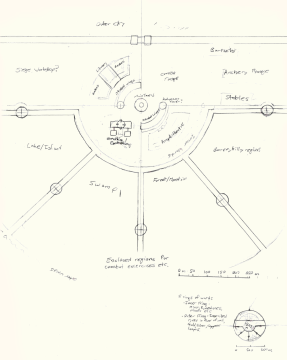

# Academy of Magical and Martial Arts

The Academy of Magical and Martial Arts is a prestigious academy governed by the Elyos military.

It is one of the larges schools of magic on the western continent, and provides training in Magic, Combat, and Magic/Combat synergy.
It was founded during the Uon war as a elite military training academy. Since the cataclysm, it has drifted away from its military roots, and has become a well regarded academic and research institution in its own right.
It is still funded by the Elyos Republic military, which gives it a degree of independance from the political landscape of Elyos. One major facet of the Academy's military ties is an arrangement where the Elyos military will 
pay the complete tuition of any student in return for 10(?) years of military service.

The Eldar Council also has a more subtle influence over the academy, as several of its members helped in its creation.

The Academy of Magical and Martial Arts is located near the source of the Great Elyos River. Consequently, it has close relations with the Hollow Cities and the more northerly Free Cities.
It is also the nearest part of the Elyos Republic to the 'jinn Principalities, and sometimes hosts delegations traveling to or from the 'jinn lands.

The academy hosts an extremely diverse population of students and staff. 
At present, there are about ten thousand students, and two thousand academic staff. The majority are 'daal, but by a much lower margin than in the rest of Eaos. A significant number of the remainder are midh. 
There are also a high number of mixed-race students, including many Riftlanders. Other ancestries are less common - between the staff and students, there are a couple hundred 'fae, about a hundred 'jinn, and a couple dozen Ael'xhal. 
There is one dragon student, and two dragons on staff.

## Structure

### Academy Center

#### Central Tower

The Academy is centered around a central tower, 66 m in diameter and 239 m tall, with a hollow core. In the courtyard at the center of this coreis a large levitating crystal linked to a teleportation circle.
This tower houses Alumni offices and quarters, Lecture Halls, Conference rooms, and Research labs, and a grand library. The roof of the central tower is a massive ritual circle, designed to magnify massive joint workings.

#### Student Wings

The central tower is surrounded by two quarter cylindrical shells inscribing a 200 m diameter circle, each 33 m wide, 69 m tall, and 132 m long, with 23 floors. 
At one end of each of these shells is a single cylindrical tower, 138 m tall.
These two buildings serve as the primary student and journeyman quarters for the academy, and can house appriximately 10,000 students and 1,400 journeymen.
Each floor is is organized into paired 10 x 14 m sections with 26 total per wing. Each section can be arranged into one of a few differnt possible configuraitons:

 - 4 dorms / section, each housing 1 or 2 students. Outer pairs (with windows) are more likely to have 2 residents (4-8/section)
 - 6 dorms / section, each housing 1 student (6/section)
 - 2 group dorms, each housing 4-8 students (8-16/section). Mostly on inner half.
 
The center of each tower houses a spiral staircase and a short-range portal network linking each of the floors. This network is split into two sub-networks, one servicing the first 23 floors of the tower/dorms, 
and the other lining the top 23 floors of the tower. Both have connections to the ground floor, the middle floor, and the underground bathouse.
The exterior regions of each tower houses administrative rooms, kitchens, and graduate housing. The top floors of the towers include warded workshops, and one houses a space for astronomy.

As the student wings house individuals who are just starting to learn magic, as well as some untrained sourcerers, they tend to be a fairly chaotic space

The floors housing the second-lokan shapeshifter students is especially chaotic. Inexperienced shapeshifters tend to be somewhat
influenced by animal instincts. This, coupled with the frequent nudity and loss of nudity taboo that generally results from learning basic
shapeshifting means that this wing tends to be quite unrestrained - shapeshifted or nude students are rather common in the hallways, and
sex between these students (in human or animal form) is rather common.

#### Geothermal Pools

Below the central tower and student wings is an extensive underground bathouse built atop a set of geothermal pools.
This is divided into a number of independant sections, with showers, pools of various temperatures, several private pools for faculty, and a very large communal pool (120 - 160 m diameter?).
It can be reached by:
 - The central spiral staircases of each student tower
 - Dedicated teleportation arches in each level of the student towers. There is also a full circle of portals inset one level below the bottom of the spiral staircase for returning to any level.
 - A set of free teleportation platforms
 - A number of private staircases originating in the central tower.
 - A public entrance on the grounds, outside the student wings.

### Inner Circle

The 500 m diameter circle surrounding the student wings houses a number of functional buildings: 

 - Library - SE Quadrant
 - Gardens - SE Quadrant
 - Smithing/Enchanting building - NE Quadrant
 - Outdoor courtyard/amphitheatre - NW Quadrant
 - Sparring range - SW Quadrant
 
#### Inner Wards

This circle is bounded by a set of wards, comprised of a circular river (which always flows, despite having no source or destination), runestones, plants, and other natural wards. 
These wards serve to keep stray magic from inside the central accadamy from interfering with the surrounding environs.

### Outer Circle

The Academy is encircled by a 2 km diameter outer wall. This wall is lined with wards of copper, silver, and gold, protecing the Academy from external forces.

#### Training Quadrants

The area between the outer walls and inner circle is split in half by another set of walls inline with the paired dorm towers, joined by a cutout (670m diameter) encircling the northern half for the Inner Circle.
The region contained between these walls and the outermost walls is split into 4 segments by another set of walls. These segments are each about 80 acres and serve as enclosed environments for training excercises:
 - W-NW segment: Barren hills
 - N-NW segment: Forest and mountains
 - N-NE segment: Swamp
 - E-NE segment: Lake, Islands

#### Quarter Wall

The other half of the of the outer circle is again divided in two, by another wall parallel to the training quadrants, with a large gate in its center. 

#### Martial Facilities

Between this wall and the training quadrants are military training buildings:
 - SE Quarter: Siege Workshop
 - SW Quarter: Archery Range, Barracks, Stables

#### Outer City

The remaining section of the academy between the outer wall and the quarter wall, houses a small city, with inns for visitors, merchents, and other entertainment. 
The academy keeps a close eye on these businesses, so they are generally of a reputable nature. 
Most non-acedemic staff (maintenance, gardeners, cooks, etc.) live in the Outer City. Some students and researchers live here as well, though they are in the minority.
All told, the population of the outer city more than double that of the Academy itself.

This section also houses the only gate in the outer wall.

### Outer Forest

Outside the northern region of the outer wall is an extensive forest, adjoining the Dragonspine Mountains

## Academy Classes

Classes at the Academy are loosely divided into Magic and Martial tracks, with majority of Magic classes held in the inner circle, and martial classes held in the martial quarters of the outer circle.

The Elyos military scholarship affords for 7 lokan of classes, with each being split into two 3-khada terms. There is a 2-hekad mid-year break, and a 4 hekhad end of year break. The first 5 lokan of the scholarship runs a fairly rigid schedule of parallel 
Magical and Martial classes. The last 2 lokan are for specilization, which can be either. This path awards its own certification, - Adept of Magical and Martial Arts.
Other students have a more variable sylabus. Most take at least 3 lokan of classes, typically focusing on either magical or martial arts. Many also go onto post-graduate studies and may remain with the academy for more than 7 lokan.
All students (scholarship or not) are expected to take at least the introductory classes of both tracks - Introduction to Magic, Basic Magical Theory, and Basic Martial Training - even if they are otherwise taking either pure magic or pure martial classes.

### Magical Track  

#### Introductory Classes

For students who have not used magic before. Covers basics of the schools of magic, but is mainly focused on teaching beginners to cast their first spells. 
Relatively unstructured, as some students grasp this quickly, and others take a while to learn how to use magic.

To be accepted into the Magical Track, prospective students must first pass this course, or pass a "basic practitioners test", consisting of three tasks:

- Light a candle
- Tell the instructure the shape of an object hidden under a cup
- Make an enchanted magelight go dark

These three tasks broadly correspond to the three classes of magic: Physical, Etherial, and Arcane; while being general enough to be solvable through a variety of methods.

#### First Lokan - Basics of Magic

Includes Basic Magical theory: Aether, Arcana and the 9 Schools of Magic; Practical use of each school (Barring Animancy, which is purely theoretical at this level; 
Sympathy and Enchanting are also both mostly theory, as they require use of another school by their nature).

#### Second Lokan - Advanced Magic

More advanced practical use - more comples techniques (e.g. teleportation), combining schools, practical sympathy and enchanting, very basic animancy.
Advanced theory - Cosmology and conjunction events, magical history, an exhaustive coverage of known sympathetic relatiosn, etc.

#### Third Lokan onwards - Specialized Magic

Classes at this level cover the various specialized disciplines of magic, like shapeshifting, alchemy, artifice, etc.
Advanced or dangerous classes like magical dueling and practical animancy are also covered at this level.

In these latter years, students are expected to select one or two specialized disciplines to focus on.
After gaining mastery of at least one specialization, a student is considered a graduate of the academy (Arcane Adept).

Many students remain at the academy for post-graduate classes, participating in advanced reasearch into their specialization, or mastering other disciplines.

### Martial Track

#### Basic Training

A variable-length course, indended to bring everyone up to a baseline level of fitness.

#### First Lokan Classes

Basic Combat - Armed and unarmed
Wilderness Survival, Travel, Camping, Orienteering, etc.

#### Second Lokan Classes

Advanced Combat - Fighting Mages and monsters, fighting in difficult terrain, use of artifacts and specialized weapons
Survival in particularily hazerdous environs - The Riftscape, the Great Desert, Western Swamps, Northern Reaches.
Siege Combat and assymetrical warfare. 

#### Third Lokan onwards - Specializations

Officer Training, Siege Engineering, Basic Spycraft, etc.
After completing a specialization, students are considered a graduate of the martial track (Combat Adept)

#### Masterclasses

Ongoing specialized training in a single combat or other Martial art - (Sword, Unarmed, Advanced Spycraft, etc.)
These classes typically require a futher three to five years of study after completing three years of the martial track. 

## Arcmuth

The city of Arcmuth is adjacent to the Academy, but it politically seperate from it - while the Acadamy is run directly by the Elyos military, Arcmuth is a civilian city, although still part of the Elyos Republic (rather than the Free Cities)
Arcmuth is about half a day's travel from the Academy by foot. It serves as a gathering spot fort for people and endeavors that want to be near the AoM&MA, but want a bit less regulation.
The city hosts a number of con artists, a few more legitimate peddlers of magical artifacts, and other diversions.

## History

Constructed around 500 BC, in the decade after the Uon war came to Eaos.
 
Major initiative in the beginning of the war, to adress the need to train troops to effectively combat the Uon and their powerful psionic abilities.
Elyos Coalition recruited architects from the most magically talented nations across Eaos/Mhidda
Architects:
 - Djinn Principalities
 - Furthern Dal
 - Hollow Cities
 - Dragonspire
When Elyos approached Dragonspire citadel about this initiative, Feathermail (the daughter of Lord Ironfire) got wind of it, and collected a couple of architects from Dragonhalls as well.
As part of the same effort, the Elyos Coalition also began sourcing staff for the new academy, from many of the same places. Several of the architects, who were responsible for creating the magical wards built into the structure of the academy,
became part of the academy staff as well.

Location was chosen as the source of the Great Eos River, at the foot of the Dragonspine mountains.
This kept the accademy far enough away from the frontlines that it could be constructed without much interference from the war, while still allowing easy tranport of goods and people to and from the academy.
Additionally, this location was fairly close to Dragonspire and the Hollow cities, and no further from the 'jinn Principalities than any other part of the Elyos Coalition.

At the time, there wasn't much in the area - several mining towns (which saw massive expansion during the construction period) and an Ael'fae gathering in the general vicinity.
The specific site for the academy was chosen as it was rich in arcana. There were a number of old ritual monoliths here, that had been erected in times past for much the same reason. Some of these were preserved as part of the inner wards of the Academy.

During the war, the Academy was solely a military training facility. The fact that it sourced both staff and recruits from across Eaos-Mhidda did make it quite unique, and gave a somewhat different formal air of other more localized training facilities 
as the different peoples and cultures mixed.

After the war, its purpose shifted somewhat. It still served as one of the major training facilities for the magically-inclined officiers of the new Elyos Republic, but also became a center of magical learning and knowledge in its own right.
The Academy began hosting general magical research and transitioned to more of a university, accepting students without any military purpose. Rather quickly, it became known as the most prestigious magical academy in central Eaos. 

Some of the staff still consists of vetrans of the Uon war, but there are also many independant magical researches, who have come to the academy due to its wealth of magical knowledge and state of the art facilities.

Military history has had a couple other lingering affects:
- Dorm structure and communal bathhouse mostly only exist because of this.
- Uniform - technically still required, though this is unenforced & only loosely followed. Is included with military scholarship, so many poorer scholarship students still wear it, as well as those particulaly proud of their military prospects.
  Some noble students pursuing an officer placement will wear a custom-tailored version.
  
