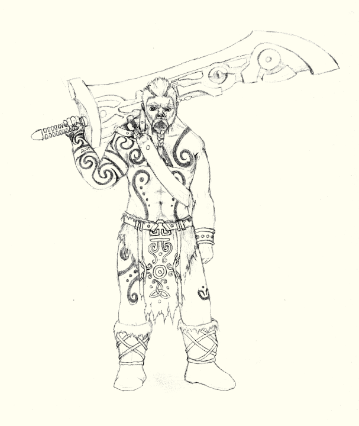

# Dhaigean Islanders

The Dhaigean are native to the Isles off the west coast of Mhidda. They are sometimes demeaningly called scrivesblodh or scraelsblodh by the Drakkar.

The Northeastern half of the Dhaigean Isles is inhabited by a variety of Dhagian clans, alongside Drakkar and the occasional 'fae. These groups are often in conflict with each other.
The Southwest region of Dhaigean Isles is all under control of a single nation. It is perhaps the single largest Æl'mið nation, but is still quite small compared to the great nations of Dael.
The Southern Dhagian have decent relations with some of the northern Dhaigean clans, and with the Elyos Republic.

### Northern Dhaigean Clans

The Northern Dhaigean Clans are quite varied. Some are small, with only a couple dozen individuals, and some have thousands of members.
Some are led by a council of elders, some by a single cheif. Some choose their leader based on strength, others based on wisdom or magical talent, others by popularity.

The northern clans are particularly notable for their use of enchanted warpaint. The sight of their wariors charging barecheasted down a hill in full bodypaint is quite the intimidating spectacle.
The clans are often in conflict over territory and long-standing grudges, but still tend retain a certain degree of respect for each other, with these conflicts being somewhere between a contest of strength and a proper war.
Every 7 years, they will put their conflicts on hold for to hold the Great Games, demonstrating feats of athleticism and strength. 

Conflicts between the clans and the Drakkar of the isles hold no such civility.

## Southern Dhagian

The southern isles are controlled by a single nation. They originated sometime after the dragon war, the extent of their borders has varied greatly in the intervening time.

They are culturally rather distinct from other 'mið, though they still speak a similar language and worship the same gods. These cultural differences are most immediately apparent in their appearance. 
They southern Dhagian are never seen in public with loose hair - it is either intricately braided, or wrapped in a headcloth. Men are most often clean-shaven.
They also have a distinctive style of dress - while the northern clans tend towards greatkilts and similar wrapped garments, the southern Dhaigean primarly wair well-tailored jackets over tunics and pants.

They are treated much like any other clan by the northern Dhagian clans, albeit a large and powerfull one. They maintain trade relations with several of the northern clans.

The southern Dhaigean are also skilled seafarers, another trait that sets them apart from the northern clans. Through this, they also maintain trade with the Elyos Republic, mainly though Teythmos.

They have little contact with the Futhern Dal, as the Southern Dhaigean dislike traveling overland on the mainland, and the Futhern Dal don't travel by sea and have no citadels on the coast.