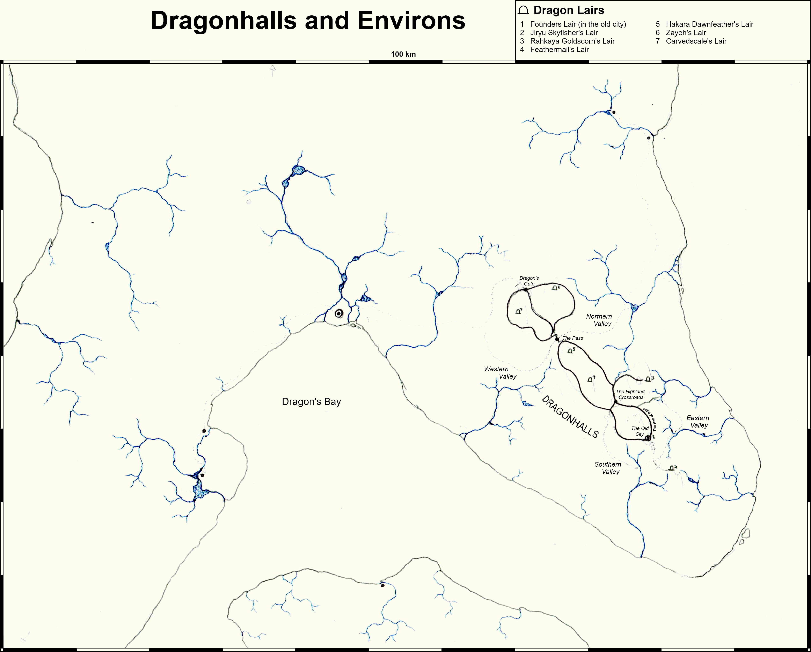

# Dragonhalls

Dragonhalls is an extensive chain of human settlements and dragon lairs built into and through the sides of a volcanic mountain chain in one of the central Kita Lau islands
It was founded during the dragon war, by a pair of dragons who mostly wanted to stay out of the whole thing, while still using the influence they had over their territory to protect the local humans.

Dragonhalls has grown extensively throughout the millenia, and now extends across several hundred kilomiters of mountain range, and hosts over a dozen dragons - 
the largest population of dragons in a single place anywhere in the world. The draconic inhabitants consist primarly of the two founders and their children's families. 
However, it has also collected a couple more eccentric dragons who prefer living among humans to the more traditional draconic lifestyle.
A few of these dragons will even deign to be ridden by humans on a regular basis, most often on hunting trips.

Dragonhalls is surrounded by farmland on all sides, both in the surrounding valleys and lowlands, and in terraces up the edges of the mountains.

## Cuisine
It is home to particular unique cuisine, which incorporates quite a lot of megafauna - wurms, levaithans, krakens, etc. 
Harvesting wide-ranging aquatic megafauna is pretty much the only way for this many dragons in one place to be sustainable.

Draconic residents help with the actual hunt, and in turn benifit from somewhat more sophisticated food preparation than is typical for dragons.
Some dragons who don't reside in Dragonhalls sometimes visit just for the food.

## Art and Architecture

Large (15-20 m tall, similar width) pillared halls running the circumference of the mountain range, open to the air on one side.
Suitible for dragons to comfortably pass through (on foot), without crowding out human pedestrians.

Large balconies, making good landing zones.

Bas-releifs, etc.

Several particulalry spectactular public bathouses. 
Most include a section with depth suitable for a dragon (5-6m for bathing, 20m+ for swimming), and an equally large section more suited to Ael.
Geothermal heat source. At least one is in an open-air caldera, and is the largest by far. Some are indoors.

## Layout

In the current day, Dragonhalls spans a 300km long stretch of mountain range, running north-northwest along the larger of the eastern Kita Lau islands. 
Along this stretch, there are 7 inhabited dragon lairs.

1. The first of these was constructed by the founders, and is about 50km southeast of the midpoint of Dragonhalls. It is inhabited by their daughter Turi, the current leader of Dragonhalls, along with her parther and the Twins.
2. The second is at the far southeast end of Dragonhalls. It is quite isolated from the Ael-built areas of Dragonhalls and was constructed by Rahkaya. It is now inhabited by Jiryu Skyfisher, a reclusive dragon from Southern Xuon.
3. Rahkaya's current lair is 80 km north of the founders lair, and is much closer to the Ael-inhabited areas of the city.
4. Northwest of the founders lair, near the center of Dragonshalls. Originally the lair of Melias, until he left, then later the lair of Turi, until she returned to her parents lair after her mother's death. Currently used by Feathermail when she is in Dragonhalls.
5. Further northwest. Lair of Hakara Dawnfeather, Turi's younger brother and father of Feathermail.
6. Northenmost region of dragonhalls. Origionally the lair of Onshu Snowspine. Now inhabited by Zayeh.
7. Westernmost section of dragonhalls. Lair of Carvedscale

A handfull of other lairs exist outside of central Dragonhalls, though only a couple are currently inhabited.

The vast majority of the aggriculture that feeds Dragonhalls occurs across four valleys - two on the northeast side of the mountain range, and two to the southwest of it.

Four major Ael population centers
1. The Old City, surrounding the founder's lair.
2. The Highland Crossroads, between lairs 1, 3, and 4, and serving as a sort of crossroads for the southeast section of dragonhalls. Its outskirts merge together with those of the Old City.
3. The Pass, in a lower section of the mountains, providing a path between the two northernmost valleys and access to the northwest and southeast sections of dragonhalls
4. Dragon's Gate, at the far northwest end of dragonhalls, both a crossroads for the whole northwest section and and a gateway between Dragonhalls and the rest of the Lauan island upon which it resides.

All of these locations are connected by a network of roofed roads inset into the sides of the mountain range, which are what Dragonhalls is named after.
While these roads are primarly used by the Ael citizens of Dragonhalls, they are all sized to accomadate a dragon - 50m wide, with a 30m ceiling.
They also feature regularly spaced open balconies, used as platforms for landing and takeoff.
Residances are typically above the halls, with public spaces like markets and bathouses below, and terraced farms below those.

Since Dragonhalls is built on a mountain range, it has an especially high altitude, with most of the major population centers at about 3,600m above sea level. The one exception is The Pass, with an elevation of 1,900 m.
Consequently, it has a relatively cool subtropical highland climate, with temperatures averageing 11 - 21 C. Over the course of Dragonhall's 5000-year history, the people living there have adapted to the high altitudes, 
and do not suffer from the mountain sickness that often afflicts visitors to Dragonhalls (and other high-altitude regions). 

The valleys surrounding Dragonhalls have a lower altitude than the urban center, averaging 1,300 m. Of the four valleys, the eastern valley has the highest altitude, at 2,200 m.

The lower-altitude coastal valleys are also populated, but are only loosely affiliated with Dragonhalls, and generally considered allies and trade partners and not part of Dragonhalls proper.

Bathouses

Significant part of Dragonhalls culture. Public bathouses are free to the populace (through private ones exist as well)

Largest in a caldera. Particularly favored by dragons for its size.
One at midpoint between two moutains, fed by hotsprings. Hosts a mid-sized town, often used as an overnight rest stop for travelers going between the Old City, the Highland Crossroads, and the eastmost agricultural valley.
One mostly interior, but looking out to cliffside.

Mid-sized indoor bathouse in the public area of the founders lair. 

## History

Dragonhalls was founded in the later stages of the dragon war (5000 BC), by a pair of dragons who mostly wanted to stay out of the whole thing, 
while still using the influence they had over their territory to protect the local humans.

Initially, the two founders (and soon after, their first child) were the only dragons residing in Dragonhalls, but they were shortly joined by a couple other dragons from Xuon, 
who were unsatisfied with the emerging Xeres Empire. At first, the settlement was focused around the founders lair, a mountain peak in the central-southeast area of its modern-day extent. 
It has grown substantially since this time

It has maintained a sizeable population ever since. At any given time, between five and fifteen dragons have resided in Dragonhalls.

Dragonhalls remained independant during the time of the Xeres Empire, and maintained somewhat more equal relations between dragons and humans during that time.
As a consequence, it served as a haven for refugees from the empire during that time.

The two founders died fighting the Uon in 1500 BC and 90 BC, respectively. However, they were successful in preventing the Uon from establishing a foothold in Kita Lau, and later assisted in the later stages of the conflict in Eaos.
The current leader of Dragonhalls is the second child of the founders.

In modern times, Dragonhalls boasts the closest relations between dragons and humans anywhere in the world. 

## Government

### Leadership

Strictly speaking, Turi Skyflower is the sole leader of Dragonhalls, and has complete power over everything.

In practice, there's quite a bit more nuance.

#### The Draconic Concordant

The draconic community of Dragonhalls operates largely independantly from the Ael government.

Gathered together for community, and to a lesser degree protection (this aspect more relevant during the Dragon Wars, Xeres Empire, and Uon War). In this context, Turi is still the nominal leader, 
but in practice most dragons manage their own afairs independantly. Dragon-Ael relations mostly go through Turi (or other members of the founder's family such as Carvedscale)

Where conflict does occur, the aggrieved party generally brings a complaint to the Dragonhalls council (if theiy are Ael) or to Turi directly (if they are a dragon), and Turi will work with the council to find a resolution.
Issues of this sort are relatively rare - most commonly encroachment of Ael too close to the outlying lairs, or excessive damage of livestock or farmland.

All that said, who's nominally in charge of something doesn't matter all that much in the moment if a dragon is tells an Ael to do something.

#### Individual Dragon retinues

Several of the dragons in Dragonhalls have close relations with the Ael populace, and have accumulated partners, friends, vassals, and other hanger's-on among the populace.
The inner circle of such retinues carry a high degree of authority among the Ael populace of Dragonhalls, while existing largely independantly of Dragonhalls' other power structures (much like the individual dragons themselves)

##### Turi's Attendants
Turi's retinue tends to overlap somewhat with the high council. In particular, the Dragonspeaker is typically someone close to her.
Edges of retinue are ill-defined - being the leader of the city, everyone is technically subordinate to Turi, and most of the city residents venerate her.
As Turi's lair is in the center of the oldest and one of the most densely populated parts of Dragonhalls, a large part of the role of Turi's Attendants is to serve as an intermediary between Turi and the wider Dragonhalls populace,
managing supplicants, maintining security of the Lair, and keeping the public parts of the lair pristine.

##### Carvedscale's ___
Carvedscale has a particularly large and varied retinue. His inner circle wears enchanted gemstones that can be used to telepathically contact him. 

Like Rahkaya, maintains an espionage group, though focuesed solely within Dragonhalls.
Maintains a skyhunter wing, though they tend to do less hunting and more joyriding.

##### Rahkaya's Talons

Many other dragonic retinues include attendants and servants, Rahkaya escewes such luxuries.
Highly purposeful - Espionage (internal and external), defence. One group of skyhunters, that acts as much as a military force as it does a hunting group.

##### Hakara's Dawnchant

Significant representation among the leadership of the northwestern half of Dragonhalls.
Along with Turi's Attendants, manages a lot of collaboration between the dragon retinues.
Inlcudes three Skyhunter groups - Dawn Glow, Argent Moon, Burnished Feather.

#### The Dragonhalls High Council

The day-to-day of the state is overseen by a council consisting of the leaders of various govt. offices, plus a Dragonspeaker selected by Turi, who speaks with Her voice, when Turi is not available.

### Peacekeeping

Major crime is virtually nonexistent in Dragonhalls proper.
Turi (and most of the other dragons in her family) are fiercely protective of the human populace. Not only does this act as a substantial deterent, the magical talents of a half-dozen dragons are sufficient to predect, detect, and/or prevent most dangers.
Failing that, between scrying and telepathy, any given dragon can pretty trivially solve anything major. Add the various dragon retinues on top of that, and it is virtually imposible to get away with much of anything.
Dragonhalls does have a nominal peacekeeping force, but it largely deals with petty crime and ceremonial activites.

Outside of the cities, crime and peacekeeping efforts are much more typical. The various valley settlements manage their own peacekeeping forces. Sentancing of major crimes may be overseen by functionaries from Dragonhalls.
