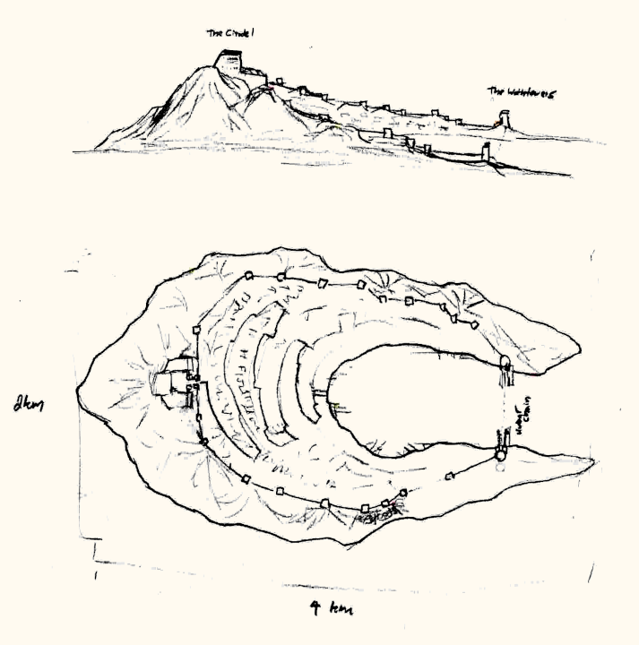

# Free Cities

The *Free Cities* (also called "The Eight" or "The Eight Lordships") are a series of loosly affiliated city-states along the Great Eaos River.
This river is readily traversible and forms the backbone of trade across central Eaos.
It is roughly 3000km long and takes 4-8 weeks to traverse by boat (depending upon whether you are travelling up or downstream)

Methods of government vary between cities, although most are ruled by one person, generally a Lord or Guildmaster. 
A council of Leaders from each city meets monthly to settle disputes and govern trade (and other interactions) between cities. There is frequent espionage and minor conflicts between cities (“squabbling”). 
Varying amounts of corruption, smuggling and counter-espionage among the cities. The free cities are home to a wide and varied mix of peoples. 

The Free Cities are politically seperate from the Elyos Republic, althrough relations are generally cordial between the two. Given their influence on trade, 
any conflict with the Free Cities would have the potential to economically cripple the republic.

The free cities were originally part of the Elyos Coalition during the Uon-'daal war, but became independant after it ended.

## Eosport

The "face" of the free cities. Not the most wealthy or influential, but still quite important. Contains the meeting place for the free cities council.
Generally agreed upon as neutral ground among the cities. 
Eosport is also the primary port of travel between the free cities and Teythmos, and hosts embassies for a number of nations.

Eaosport is primarly built on the ruins of the former Elyos capital, at the time called New Aelmos (not to be confused with the 'jinn city of the same name). It was originally founded in 2500 BC, 
and razed by the Uon in 100 BC, after which the Elyos coalition moved their capital to Tethmos.

Eaosport is one of the four founding cities of the Free Cities Alliance, alongside Bridgeport, Grandel, and Kenford.
It has not regained the size or power it had before the war, but is still a large and influential city.

Eaosport is more stratified than Haven - noticible divide between Docks / Merchants Circle / Upper City
In particular, different peacekeeping forces
 - Upper City Guards
 - City Watch - technically have jurisdiction over the whole city except the High Council Chambers, but in practice mostly only present in Merchants circle and various gates/bridges
 There are also private forces present in certain areas
 + Private Mercenaries employed as guards in the Merchants quarter, and some warehouses in the docks
 + Assorted Gangs in the docks

### Layout

The city layout roughly follows that of the ruins it was built on top of.
The main city is built on the southeast coast of the river, and divided into three tiers, each being further inland and higher in elevation.
These tiers are connected by three broad avenues, radiating from the city center.
 - The first tier is the main working hub of the city, consisting primarly of docks and warehouses.
 - The second tier is the middle city, with inns, merchants and marketplacess, dwellings, and artisans.
 - The third tier is the domain of the higher classes, containing manor houses of lords and wealthy merchants, embassies, banks, and select luxury shops.

The city center is about 1.5 km inland, and includes various government buildings, with the Council of Lords at the center, where the eight lords of the Free Cities council meet.

On the opposite coast of the river are slums, housing much of the cities poorer residents.
About 2km upstream of the main city is the Tower Bridge, connecting the two shores.
There are also a number of ferry crossings closer to the core city.

The stratified nature of Eaosport's layout is mirrored in its residents and peacekeeping forces. There is a substantial class divide between the three tiers, made most obviously apparent in its various peacekeeping forces.
 - The Upper City Guards have ornate uniforms, with gilded armor, vibrant <color> cloaks, and crested helmets. They can be seen throughout the upper city, especially around the High Council Chambers, and report directly to the Lord of Eaosport.
 - The City Watch technically have jurisdiction over the whole city (except the High Council Chambers), but in practice they are primarly seen in the middle tier, and among the various gates, bridges, and docks throughout the ciy. 
   Their uniforms are more functional than those of the Upper City Guard, and they are part of the regular heirarchy of the city's bureaucracy. 

Many of the wealthier mercantile organizations in the city also employ private mercenaries, who can be seen both in the middle tier, guarding manors, guildhouses, and storefronts, and in the lower tier, guarding docks and warehouses.
Additionally, various gangs hold power over certain parts of the lower tier and the slums.

## Haven

Haven is east of Eaosport, on a different tributary of the Great Eaos river delta, and adjacent to Trader's Bay. Most of the bulk trade between Tethmos and the free cities goes through Haven. 
The city also hosts many shipyards, which source wood from all along the river.

Haven is the oldest and largest of the free cities, founded in 2910 BC by refugees escaping the Lich wars.
While it was named Haven due to the circumstances of its founding, this name has remained accurate in the modern day, where it has served as a refuge for people fleeing the Uon war, 
and more recently as a safe harbour for slaves escaping Blackport and its environs.

Haven is very much a city that has grown up over the ages, functioning more like a dozen cities in the guise of one.
Districts are frequently dominated by enclaves of local, wealthy families, who have their own personal guards, supplemented by mercenary forces.

By its constitution, the city is managed by a representative democracy, with representatives elected from each of the many districts.
In practice, it functions more as an oligarchy, with as the various entrenched powers across the cities districts have enough influence to sway the elections in their favour, baring the occasional coup.
Despite this, the city is reasonably well-run, and a decent place to live for even its poorer residants.

The council of representatives elects their own prime minister, to represent the city in the Council of Lords. While this role is prestigious, the prime minister does not hold any more power than any other representative, 
and mainly serves as a face for the intersts of the council as a whole. 

## Blackport

The common wisdom in Eaos is that you can get anything in Blackport, for the right price.
The main city of Blackport is on a crescent-shaped rocky isle at the mouth of the westernmost tributary of the Great Eaos River delta, and is not directly connected to the mainland. The nearest coast is full of impassible swampland, making the city especially isolated.
There are some fishermen and farmers along the banks of the river, but Blackport primarilly relies on trade for food.

Blackport originated as a military base, build in the middle of the Uon war. It fell near the end of the war, and was later reclaimed by pirates, who built it up to its current form.
Most illicit or morally dubious trade goes through Blackport. This includes drugs derived from swamp plants, slaves from the xhal isles, and any other goods 
that would be difficult to pass through Eosport or Haven. Rarely, this includes dangerous magical artifacts from the riftscape.

The city owes its continued independance due to a combination factors: 
 - The relative dissaray of surrounding nations in the wake of the war.
 - Various wealthy and influential indivituals inhabiting said nations who find the cities services useful.
 - Its extreemley defensible location, coupled with a very potent mercenary force guarding the city.

Most of Blackport's residants live on the inner edge of the isle. At the midpoint is the Citidel, where the Lord of Blackport and supporting functionaries live and work.  

### The Lord of Blackport

There is a great deal of politicking and backstabing within the Citadel, so the Lord of Blackport changes fairly frequently.
They tend to be primarly skilled in politics and espionage rather than magic or force of arms.

The Lord of Blackport has direct authority over the Shadowsteel Guard and Citadel Staff.
Typically goes about robed and masked when outside the citadel, so than no-one outside the guard and staff know quite how often leadership of the city changes.

### Notable Organizations in Blackport

#### Shadowsteel Company

The Shadowsteel Company is a mercenary company based out of Blackport. While their services are for-hire, they are still largely under the control of the Lord of Blackport.
The company is equiped with magic-blocking black-iron armor and weapons. They are primarly outfitted with crossbows and halberds.

##### Shadowsteel Guard: 

A branch of the Shadowsteel Company permanently garissoned on Blackport. Members of the company are recruited into the guard based on their loyalty.
They guard the Citadel, and control entry into Blackport Harbor.

#### Citadel Staff
Network of clerks, bureaucrats and officials that manage finances, tarrifs, and city operations, as well as facilitating off-island smuggling and procurement through bribes, espionage, and blackmail.
Reports directly to the Lord of Blackport. Most Lords of Blackport are killed by and sourced from the Citadel Staff.

#### Yellowjackets
Blackport Harbor Guard. Collects tarifs and maintains order. 
Nominally a branch of the Citadel Staff, though the two groups do not really get along with each other.

#### Free-traders Association
Loosly organized collective of pirate captains, established to provide greater negotiating power with the Citadel. Controlls piracy, smuggling, and transport to and from the citadel.

#### Professional's Office
An independant guild which manages sourcing and contracting assasinations, kidnapping, high-value theft, and other ilicit services

#### Records and Tarrifs Office

A large, and fairly brazen guildhouse for the Order of Sion.
While it still functions and presents as a records and tarrifs office, it's identity is very much an open secret.
It is not the largest Order of Sion office, but it is definitely the least hidden.

#### Guild of Dock and Warehouse Workers
A rather well-organized laborer's union, whose power hinges on control of the warehouses (and their contents).
They are tolerated by the citadel because they can play the guild off of the free-traders association to avoid either group establishing too much power.

#### Hospitality Guild
Collective of inkeepers with control over inns and lodging, but also safehouses, trafficking, and prostitution.
Loosly allied with the Free-traders association, with the goal of minimizing Citadel interference.

### History of Blackport
Blackport started as a naval base and garrison for the Elyos Coalition. It was built in the middle of the Uon-'daal war, sometime before 200BC. When New Aelmoss fell in 100 BC and the coalition capital moved to Teythmos, 
the size of the base's garrison was reduced. It was eventualy captured and razed by the Uon in 10 BC.

After the Uon cataclysm, some opportunistic pirates took over the ruins of the garrison. The first "Lord of Blackport" was a pirate captain from this group who found a complete set of Uon armor in the ruins shortly after settling there.
The pirates were able to scavenge many other arms from the base as well, making them well equiped and quite wealthy.

Around 18 AC, the new Elyos Republic and the Free Cities has re-organized well enough to do something about the increasingly well-organized pirates based on the island. Their first attempt was an unexpected failure.
The island was eventually reclamed by a mage-breaker batallion turned mercenary company, though the reclaimed effort was relatively bloodless - after an initial show of force ending with the pirate captain at the bottom of Blackport Bay, 
the pirate occupiers saw they were clearly overmatched. The company leader promptly turned face on the Elyos Republic and demanded control over the island to ensure the pirate raids stopped. 

The mercenaries set themselves up in the old garrison as the new rulers of Blackport, while the remaining pirates pivoted to smuggling and privateering. The Blackport remained relatively stable for the next few years.

In 21 AC, a merchant from Bridgeport came to Blackport seeking a partneship, offering both easier passage through Bridgeport, and more sources of illicit goods across Traders Bay and the Great Eaos river. This delegate succesfully established an 
alliance with the mercenary leader, and both were greatly enriched by the partnership. Not long after, a clerk overseeing the merchant operations in Blackport orchestrated a coup, killing the company leader and ousting the merchant from Bridgeport, 
putting herself in sole control of operations. Shortly after establishing control over Blackport, the new leader established a more formal alliance with Bridgeport, and eventually joined the Free Cities in full.

In 34 AC, after a relatively long period of stability, featuring a significant increase in the influence and legitimacy of Blackport, the former clerk and current Lord of the city was assasinated while traveling between Blackport and Eaosport.
She was succeeded by a seinor member of her staff (no one ever found out for sure if they were responsible for the assasination). This new lord made some significant organizational changes to the leadership structure of Blackport, and began the practice
of the Lord of Blackport always going around cloaked and hooded.

As of 50 AC, the Lord of Blackport has been assasinated and replaced at least twice more (with all the cloak-and-dagger secrecy, no one knows for certain if there have been some undetected assasinations). The last couple of Lords have never shown their face, 
and have been more or less indistinguishable. 

## Bridgeport

Bridgeport stradles the great river just before it splits into the three tributaries that feed Trader's Bay. Consequently, it controls all trade that passes up or down the river (and benefits from all the resulting tarifs)
Some illicit trade from Blackport passes through Bridgeport, expediated by hefty bribes to the right officials. However, most of the more blatantly illegal trade (slaves, certain drugs) is not tolerated at any price 
(although these are sometimes smuggled through anyways). 

Since it straddles the river, it is also a major hub of ground-based trade through central Eaos.

The city itself is ruled by a single wealthy family, with the role of ruler being passed down through the family, though the specific line of inheritance is rather flexible, being influenced by competance and the favour of the current ruler.
The ruling family itself has changed a few times over the cities history through various coups, but such changes are rare. 

Bridgeport was originally founded in 2490 BC, though the great bridge that gives it its name was not built until several centuries later.

The Toll collectors and Gate Guards seen wherever goods and money flow through the city are employed directly by the ruling family.
The city also employs a constabluary, tasked with keeping the peace and stopping crime. They are much less prominent than the Guards and Toll collectors, and hold less power.

## Elgate

Elgate is a smaller city between Bridgeport, Eosport, and Haven. It subsits almost solely on income from tariffs and travellers (lodging, etc.). 
The city is on the same delta as Eosport, and there is a little-travelled ground path between them.

Elgate is currently run by a merchant family, which took control after the Elyos army moved out at the end of the Uon war.

While the land on which Elgate sits has been populated for a very long time, it only really grew to a true city in 100 BC, after New Aelmos was razed by the Uon, and the fleeing inhabitiants moved north.
It rapidly grew from a fortified refugee camp to a true city.

## Vindel

Vindel is upriver of Bridgeport, on the northwest bank. It serves as a hub for many vinyards and other farms in the area, and is generally considered to produce the best wine in the region. 
Ships goods overland to Elyos, as well as up and down-river. Vindel was founded in 2300 BC, and is ruled by a hereditary monarchy. 

The farms and vinyards that feed Vindel overlap the borders of Elyos (even moreso than most of the Free Cities), but in practice they fall under the domain of Vindel.
The city itself employs two different guard forces
 - City Guards
 - Citadel Guards

The winemakers and mercants of the city also hold significant political power, and many of the vinyards employ their own mercenary guards.

At the end of the Uon war, Vindel initially became part of the Elyos Republic. However, it seceeded to join the Free Cities in 13 AC. This was mainly for economic reasons - The initial group of Free Cities included both Grandel and Bridgeport, 
so Vindel was getting hit by tarrifs upriver and downriver. Joining the alliance brought vindel into the Free Cities trade group, getting them out of this undesireable situation.

## Grandel

Grandel is Vindel's sister city. It is located in the center of a large swath of farmland, especially grain. The city produces a significant percent of the Free Cities food supplies, and also ships food overland to other regions.
Like Vindel, the surrounding farmland extends into Elyos but still effectively belongs to the city.

Grandel is the second-oldest of the free cities after Haven, and was founded in 2690 BC. Historically

The city employs a cadre of rangers help keep its fields and farms secure and project power into the nominal borders of the Elyos republic. 
In addition to food, Grandel produces wines, textiles, and other goods. It is the furthest upriver of the major free cities.

Grandel was one of the four founders of the Free cities.

## Kenford

This city straddles the river between Vindel and Grandel, and benefits from trade both up and down river.
In addition to being a notable trade center (comparable to Eaosport, but not quite at large as Bridgeport or Haven), the city is also a respectable hub of magic.
It hosts a guild of mages, not beholden to the Elyos Republic (unlike the AoM&MA).

Prior to the Uon War, Kenford was a small port city between Vindel and Grandel, of little renown, though still quite old, having been founded in 2200 BC. During the Uon war, it was the base of a operations of renowned Mage-general, 
who established the Kenford Mages Guild in 30 BC. When the Free Cities split from the Elyos Republic in the aftermath of the war, he became the ruler of Kenford, and positioned the city as a center of arcane learning in the Free Cities, 
independant from the Elyos-controled AoMMA. Since then, its importance has increased significantly. The city is currently ruled by his son.

### Layout

Kenford is located on the west bank of the Great Eaos River, where a smaller tributary joins the main river.

The east side of the city is dominated by docks for ships traveling up and down the river.
The docks adjoin the **Warehouse District**, containing primarly warehouses, inns, hostels, and brothels. It also hosts the cities customs offices and a Kenford Guard garrison.
West of the warehouse district is the **Merchant's District**, surrounding the main city gate and hosting merchants, various other services like fariers and coopers, and some slightly more upscale inns.
North of these two districts is the local Church of Daelios, and the **Gardens District**, which is a large green space taking up most of the northeast corner of the city.
West of the merchant's district is the **South Quarter**, containing primarly lower-class housing. North of this, seperated by a canal, is the **Middle Quarter**, containing primarly middle-class housing.
Further north, after another canal, is the **Banker's District**. As the name would suggest, this is the financial core of the city, containing banks, moneylenders, and moneychanges, but also the city tax office, foreign affairs offices, several jewelers shops, and the city mint.
The northwest corner of the city is the **West Quarter**, and holds the city's secondary gate, along with a mix of middle-class housing, upscale inns, and miscelaneous merchants. Much of the city's civil service lives in this quarter.
Between the west quarter and the gardens district is the **High Quarter**, containing upper-class housing hand upscale merchant's, and the **Lord's Manor**, housing the lord of the city.

Seperated from the main city by another branch of the tributary river is the mages quarter.
The **Mages Quarter** is the westmost region of the city, and is on its own chunk of land seperated from the main city by another branch of the tributary river.
Three bridges connect it to the rest of the city - one to the south quarter, one to the middle quarter, and one to the bankers district. The quarter also has two gates leading outside the city.
The mages quarter was built after the Uon war and has visibly more modern archtecture than the rest of Kenford. 
This is most noticable in its walls, which are pristine, and have round towers, compared with the sqaure towers and more weathered walls of the rest of the city.

There is also a fair number of buildings outside of the walls south of the city, near the main gate. These are generally considered part of Kenford proper.  

### Kenford Mages Guild

Most renown mages guild of the free cities, though somewhat overshadowed by the Acadomy of Magical and Martial arts.
Unlike the Academy, it is not a magic school, however guildmembers may take apprentices. The guild also provides facilities and resources for members to perform research.

The guild consists of ... buildings. The largest is the main guildhall, which houses ... an extensive library, enchanting and alchemy facilities.
Behind the guildhall is a courtyard with a teleportation circle, enclised by a semicircular building containing housing for visiting guildmembers.
Surrounding the guildhall are a handful of detached buildings for more volatile research.

The guild is located on a seperate island from the rest of Kenford, and connectred to the city by three bridges. This island also houses various buisinesses, and homes for those guildmembers who live in Kenford.

The current guildleader is in her late 50's, and has led the guild for over 20 years. She has a wide range of skills, but is mostly focused on the more subtle magics - scrying, enchanting, illusions, and such.

### Kenford Guard

The Kenford guard is responsible for policing, security, customs, and taxation throughout the city. They report directly to the city's ruler.
Their uniforms consist of a red-dyed leather surcoat with silver detailing and a cloak - grey for regular guards, grey with red trim for lieutenants, and red for captains. This has earned them the moniker "Greycloaks".

The guard includes a disproportionate number of magical adepts, with most of the force having at least some magical talent, and almost half being skilled mages. 
The adepts among the guard wield arcane staves capped in sky-blue crystal in place of spears.

## Others

There are a number of smaller towns up and down river. These are much less important then the eight main cities, and are typically beholden to one of them. 
For the most part, they are located about a days travel (by river) from the next nearest city, and partly serve as rest points.

Armuth and The Academy of Magical and Martial Arts are both near the mouth of the great Eos river, but are not counted among them, as they are very much a part of the Elyos republc.
