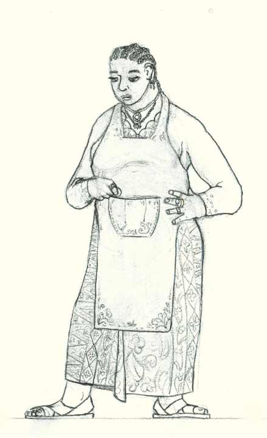
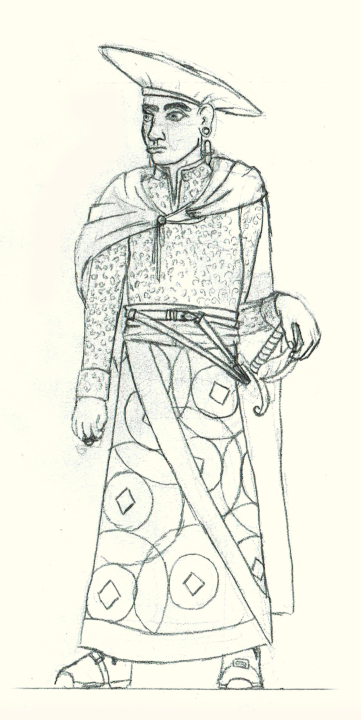

# Æl'daal 

The Æl'daal are the closest descendants of the ancient Ældar civilization, and now inhabit much of the known world.
They can be found throughout Eaos, many of the neighboring regions.
They are olive to dark skinned with black or brown (curly) hair. They have green or brown eyes.

The Æl'daal have no natural magical abilities, but have a natural talent for magic in all its forms. They do tend to lean slightly towards physical magic and sympathy.

The [Elyos Republic](../../organizations/elyos_republic) (which formed from a collection of losely allied contries during the Uon war) hosts the largest population of Æl'daal, but there are several other notable Daal countries. 
The [Free Cities](../../organizations/free_cities) is a series of independant city-states to the southeast of the Republic. The Republic and the Free Cities have a high level of technology and great deal of knowledge of the workings of magic and the physical world.
The Enhat-Tehktun are further south, and formed from the remenants of a couple Xhal and Daal countries that were destroyed during the Uon Cataclysm
The [Sach’ean Daal](../../organizations/sachean_isles) are an ancient island nation, roughtly equal parts Ael'daal and Merfae.
The [Riftlander nation](./riftlanders) is on the coast between the Free Cities and the Enhat-Tehktun. While its citizens come from many nationalities, the majority are Daal.

## History

The origins of most modern Ael'daal nations can be traced back to the 'daal exodus from southern Eaos during the Lich wars of 2900 BC.
The majority of the 'daal fled northwest, and formed communities arround the Great Eaos River. These retained much of the culture of the pre-exodus states that they formed from, and rapidly grew into city states, 
supported by verdant farmland on both sides of the river.

A smaller group of 'daal fleed west, to found the Kingdom of Al-Enjat on the Enhat peninsula.

As the lich wars drew to a close and the sourthern half of Eaos became a barren desert, the Eoasian states around the Great River expanded northward.
The greatest city-states remained those surrounding the great cities, but new states sprun up in the vast wilderness in central Elyos.
This region was much less densely populated, so these new states tended to control much more land then the city-states on the river. 
Many small border wars cropped up between the new states in order to actually establish what each one controlled. 

During this time, there was also some conflict with the Daal'fae, who had been living in central Eaos since well before the 'daal arrived. 
After about a hundered years of fighting between various groups (though less and less in the latter half of this period) peace treaties were eventually established between most of the involved states, 
laying the groundwork for a golden age of trade and cooperation between the 'daal – 'mið (though this would not truly bear fruit for another 500 years).

Around the same time, the more southerly states began sending expeditions into the great desert left behind by the Lich wars. 
At first, these expeditions encountered hostile fae, barren, magicless desert, and the ocasional ruin. As they delved deeper into the great desert, they started to encounter foreboding monoliths surrounding sealed tomb-cities.
An ill'fated expedition breached one of these and releasing the lich that had been sealed within. While the expedition was anhilated, they were able to get word to the Eoasian river-cities in time for them to send another expedition to destroy the lich. 
Future expeditions were much more careful, but eventually discovered the Ael'jinn Principalities and reestablished communications between the Æl‘jinn and 'daal.

In 1,600 BC, the Hollow Cities were founded under the Dragonspine mountains northeast of central ELyos, in a joint project between the 'midh, 'daal, and 'jinn.
A network of teleportation circles between the Hollow Cities, several key Elyos cities, and the Ael'jinn capitol.

The next millenia marked a golden age of peace across Eaos. This period saw few significant wars, though some borders did change and some Elyos states were absorbed into others, mainly due to economic factors.
During this time, the central Eaosian 'daal also made contact with the Kingdom of Al-Enjat, though travel between the two regions was difficult enough that there was never much more then some light trade between them.

This golden age ended in 500 BC, when the Uon completed their conquest of Xuon and began a campaign against Eaos, starting on the west coast.

### The Elyos Coalition (400 BC)

In the face of the Uon war, the various Æl‘daal states officially unify into the Elyos Coalition. Individual states retain control over internal affairs, but aggre to contribute resources and personall to the war effort, which is to be managed by a single joint authority.
Officially, the Coalition was comprised of all the central Elyos States, several of the more southern 'midh territories (including Dragonspire Citadel, and the Hollow Cities, 
with several Futhern Dal nations and the Ael'jinn principalities remaining fully independant allies of the Coalition. 

New Aelmos (now known as Eaosport) was chosen as the Capitol of this coalition, hosting representatives of each member state. Much of the logistics of the war effort were routed through this city. 
The facility now known as the AoMMA was the most elite training facility, training troops from across the continent in both physical and magical combat. 
The Great River served as a backbone for transporting food, supplies, and troops from central Eaos to the frontlines, with additional supply routes along the west coast of Elyos.
 
### The fall of New Aelmos (100 BC)

- 100 BC
  - New Aelmos sacked, and the Coalition Capitol is moved north to Teylmos, which had already been serving as a nexus of supplies and troops from the northern portion of the continent. 
  - At this point, borders and independance of a lot of the smaller Elyos countries had blurred substantially.
  
### The Eaosport Accords (0 AC)
  From a military coalition to a country.
  Formalized Elyos republic as a true country
  Talks began in Tethmos. Early topic was independance of the free cities
  - started with Easport wanting money for rebuilding, & refusing to join the republic if this was not granted
    - Republic in economic ruin after the war & refused
  - Bridgeport started the idea of a coalition of independant cities, and got Grandel on board
  - Kenford joined in and fearing it would forever be overshadowed by AoMMA; if it remained part of the republic; as part of the new Free Cities it could in theory compete as a source of magical goods and knowledge
  - Haven also made a bid for independance, but did not initally join the Free cities. Elgate was minor enough that it didn't really get a seat at the table, and with Eaosport, Haven, and Bridgeport all seeking independance, wound up independant by default. Both joined the free cities several years later.
  - Vindel initially joined the burgoening Elyos republic. Secceded from the Republic to join the free cities 13 years later, for economic reasons.
  Regions south of the free cities were effectively destroyed by the cataclysm, and abandoned (though Riftlanders rebuilt on the rift's edge, and some of Enjat survived in the Enhat-Tehktun.
  
  Other groups:
  - 'jinn - remained independant, most everyone expected this outcome, given they lived half a continent away.
  - Ironspire citadel
  - Hollow cities.
  - midh territories
  - Futhern daal
