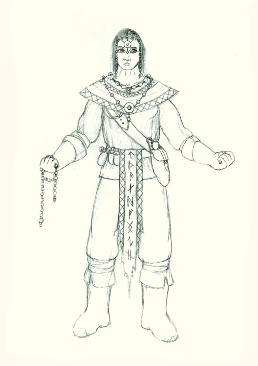

# Æl'mið 

The Æl'mið inhabit the northen reaches of Eaos-Mhidda. They tend to be tall, with red or blond hair, and blue, green, or purple eyes.

The 'mið have a natural affinity towards enchantment in all its forms. The Futhern Dal are known as great smiths and crafters of magical artifacts. The Dhaigean Islanders use enchanted warpaint and tattoos to enhance their physical abilities.

There is no single large Æl'mið nation. Instead, they consist of various small countries, city-states, and tribes.
These can be loosely organized into four main groups:
- The [Futhern Dal](../../organizations/futhern_dal) are a collection of independant city-states located in large mountain strongholds which extend deep underground. They are found only on the Mhidda mainland, near the Dragonspine mountans, 
  and host some of the best smiths and artificers on Dael.
- The [Drakkar](../../organizations/drakkar) is the collective name for the varios clans of raiders and barbarians found across the coast of Mhidda, both on the mainland and the Dhaigean Isles
- The [Dhaigean](../../organizations/dhaigean_islanders) are native to the Isles off the west coast of Mhidda. They are sometimes demeaningly called scrivesblodh or scraelsblodh by the Drakkar. The Southern Dhaigean are perhaps the single largest Æl'mið nation, 
  but they are still quite small compared to the great nations of Dael.
- The Hollow Cities are a collection of city states jointly build by Æl'míð and Æl'jinn inside the hollowed out centers of various mountains, and are the most southerly of Æl'míð cities.
- There are also a handfull of small provinces in the heartland regions between the coast and mountains. Most of the more southerly such provinces are vassal states to the Elyos Republic, but primarly Æl'mið demographicly. Culturally, 
  they are most similar to the Futhern Dal, but have fewer deep mountain strongholds and more freestanding castles. These provinces are relatively new compared to the Furthern Dal, or even some Drakkar tribes.

The region between southeast Mhidda and Northeast Eaos is inhabitted by 'mið who aren't quite like Drakkar or Futhern Dal, but somewhere inbetween. They live in fortified cities and subsist mainly on farming, and maintain an effective military.
Many of these cities have become protectorates of the Elyos Republic.

## History

Mhidda was first settled around 10,000 BC. The early inhabitants were mostly hunter-gatherers, but farming communities were established eventually.
In 8000 BC a large group of these early midh migraded across an ice bridge spanning the Dragon's Tooth Isles to become the predecessors of the Ael'Thaal

The next 3000 years have a long and storied history, featuring the rise and fall of various great 'midh kingdoms reaching across western Mhidda and into nothern Eaos.
This period has become mythologised in the modern era, and depictions of the people and events from this time feature prominently in many 'midh stories. 

The last great 'mid kingdom fell during the beginning of the Dragon War in 5000 BC.
In the aftermath of this, many 'mid retreated into caves and mountain fortresses near the feet of the Dragonspine Mountains, to better defend themselves from hostile dragons. 
As the conflict progressed, these 'mid built up their defenses and delved deeper underground, becoming the precursors to the Futhern Dal.

After the end of the Dragon War, the 'mid consisted of many large but isolated mountain strongholds, along with scattered sparsely populated settlements. 
Several of the strongholds attempted to conquer the 'midh heartlands and rebuild a 'midh kingdom, but none of these attempts ever reached the heights of those that came before the war. 
Some of these would-be conquerers eventually split from the strongholds that they originated from to form their own independant states.
Over the years, this resulted in a situation where all the most expansionist and radical elements established independant states throughout the once lightly-populated 'midh heartland and coast, 
while the more defensively inclined further fortified their mountain strongholds. This led to frequent conflict between these heartland nations. On a few occasions, some warlord built up enough of a following to unite or conquer several of these nations, 
but each time this happened, some number of Futhern Dal strongholds formed a temporary alliance to quash the rising thread before it could become powerful enough to successfuly conquer any one of them.

The one place where these expansionist factions had some success was the Dhaigean Isles, where there were no Futhern Dal to keep them in check.
The southern Dhaigean Islanders originate from this time. The northern islanders predate them, originating from the small number of Dhaigean 'midh who survived the Dragon war by hiding in the forests and caves of the islands.
The northern islanders had reclaimed the entirety of the isles before the southerners arrived, and there are still lingering tensions between the groups because of this. 

The Midh'fae also originated around this time, establishing themselves deep in the wilderness of Mhidda.

The Ael'daal eventually spread to northern Eaos around 2,600 BC, in the wake of the Lich Wars that devestated much of southern Eaos.
This further stymied the ambitions of any would-be warlords. Over the ensuing years the 'daal spread further north, converting some of the 'midh into vassal states.

The Drakkar have been present in Mhidda since shortly after the Dragon War, with their numbers ebbing and flowing depending on the stability of the various heartland midh nations.
More recent conflicts have bolstered their numbers, with new clans arising from remnants of collapsed heartland nations.
