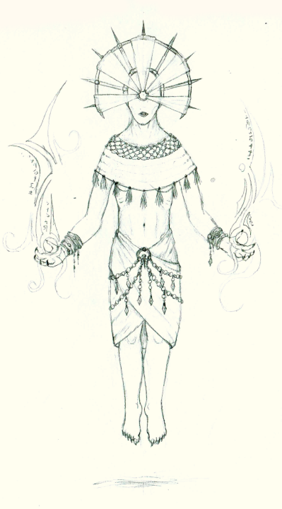

# Uon (Psions)

The Uon diverged from the same common ancestor Ældar about 100,000 years BC (Before Cataclysm). Early in their evolution, the Uon developed potent telepathic abilities that eventually defined their culture and appearance. 
Around 50,000 BC, the Uon had developed a collective consciousness spanning their entire species, and the Uon physiology had diverged substantialy from the Ældar. 
Around 2000 BC, the rapidly growing civilizations of the Uon and the Æl’daal came into contact with one another. Conflict between the Uon and the Æl’daal continued over the next 2000 years, 
with the Uon gradually gaining territory on the western continent. The Uon civilization was completely wiped out when an attempt to create an artificial god/racial power source. 
This caused a magical overload across the Uon species, and threw the magical energies of the region into chaos, creating the riftscape. 

Since the Uon share a collective conciousness, individual personalities tend to be rather subtle, but do exist.

The Uon culture is somewhat hierachical, with the majority of the population comprised of menials/workers, responsible for agriculture, construction, and powering large magical workings. 
The higher echelons of this hiearchy are include overseers, researchers, and focci for magical workings (enchanters, architects, priests/magi, and warlords).
Uon also take slaves of other peoples for use as basic menial labor.

The Uon communicate telepathically, and do not have a spoken language.

