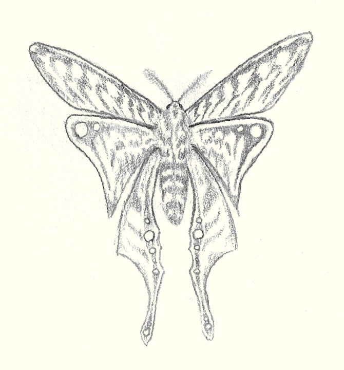

# Concha

Members of concha are supported by an external skeleton and generally have a simple nervous system.
This phylum includes insects, along with large chitinous sea-creatures.

# Morphologies

## Carkata

Members of the Carkata class have 6 or more body segments, each with a pair of limbs. They generally breathe through gills and are amphibuous.
The class includes a wide variety of creatures, such as living islands and shorecombers.

### Cratcha

This order includes most crab-like creatures. Members have 2 - 4 clawed forelims, with the remaining limbs forming legs (thoough the last pair or two may be more fin-like)
Generally ampphibuous scavengers.

#### Sidecrawler
A wide, flat crab whose body can grow up to two meters wide. Typically remains on the shoreline, scavenging food washed up by the waves.
As its name suggests, moves sideways.
Not very smart, and generally not hostile to Ael. A basic food lure can be used to direct its movements, which makes adult Sidecrawlers suitible for transporting small loads.

#### Riftclaw

All twelve limbs end in smalish claws, making this a very effective climber.
Otherwise, has a somewhat variable morphology that differs from other Cratcha in unusual ways. Not known to exist prior to the cataclysm
Many subspecies, varying in size from 10 cm to 8 m wide.

Some have been found to be tameable

#### Shore Stalker

Ambush predator. Buries itself in sand just below the waterline
Strong and fast for its size. Sometimes used to pull carts, typically through an incentive of fresh fish

#### Greater Shorecomber

Large crab-like creature that dwells around coastlines, scavenging just about anything that has washed ashore.
About as tall as it is wide. 
Slow-moving, and fairly consistently remains partway above water, so animals (and sometimes Ael) often build homes atop its shell. 

#### Sea Strider

Long, double-jointed legs. Air bladders in its body allow it to float. Legs are covered in venomous spines and end in claws. Feeds by catching prey in these spines, similar to jellyfish, though on a rather larger scale.
Can grow up to 50 m tall.

### Leviathans

Leviathans include many of the largest creatures on Dael. 
They are all strictly aquatic, and typically have a long body, with many legs adapted to fins.

#### Living Island

Living Islands are the largest creatures found on Dael, with the biggest specimens growing up to a kilometer long. 

They have a pointed snout with two antenae and six feathery tentacles that are used to trap krill, jellyfish, and small fish. Where this snout meets their head, Living Islands have two pairs of black compound eyes, 
set just below a ridge which extends around the sides of their head. Their head widens into a large body segment, with many banks of gills on the underside and a tall peak.
Subsequent segments are tapered, each smaller than the last. Each segment has a pair of finned segmented legs, emergeng from the back corners of the segment.

Adult Living Islands float along the surface of the ocean collecting food in their tentacles. The upper part of each of their body segments consist primarly of a large gas bladder which keeps them afloat. 
They are incapable of submerging, and rely on their massive size ans thick armor to protect them from harm. Vegetation can be found growing on the abovewater parts of their shells, providing a natual camoflauge.

Juveniles look quite similar to adults, but are much smaller and spend most of their time fully underwater, often in coral reefs or similarly sheltered ecosystems.
After they reach around 1 meter long, they spend more time in open waters. By they time they reach 50-100m long, they are generally locked to the surface of the ocean.

Living Islands are biologically immortal, and continue growing throughout their life. Kilometer-long specimens are exceptionally rare.

#### Broadhead Leviathan

The broadhead leviathan is and active predator and fast swimmer. 
They are typically 15-30 meters long and have a large, flat, head shaped like a wide diamond.
Their first pair of limbs are small claws held under its head. The second pair are large, broad fins.
The body segments after the head are smaller and more rounded, tapering towards the tail-end. Each have a pair of small, leg-like fins.

They can be found at a wide range of depths, and prey on a wide variety of smaller creatures, from serpentfish, to other leviathans, to squid and jellyfish.
Hollow spaces in the leviathans head gives it sonar sense with a high degree of directionality.

#### Triclaw Leviathan

Among the larger leviathans, 50-100m in length.
Head and second body segment are relatively small.
Third segment is larger and fouth is larger still.

Three increasingly larger pairs of clawed limbs are attached to the first three segments, giving the Triclaw leviathan its name.
The fourth segment has two large fin-like legs. Subsequent segmetns are smaller, and taper off into a finned tail. 

Tryclaw Leviathans often go after prey of a similar size to themselves - other leviathans, ocean wurms, and krakens.

## Krinids

Long, flexible, multi-segmented body.
Various limb configurations - some have many many legs, others have one or two clusters at different points of body.

## Ossagers

Multisegmented body (between four and six segments, sometimes fused), eight legs.
Includes armored bicorn.

### Armord Bicorn

Large herbivore, about the size and shape of a rhino.
Found across Eaosian grasslands, and eastern edge of the Great Eaos desert.

8 legs, with thick, blunt feet No joits below the elbow - the entire lower leg is a single fused mass of armored carapace.

Head has a wide, flat horn extending from the center, which splits into two halfway along its length 

Legs let it turn over earth and dug for roots and tubers.

Some have been semi-domesticated, and are used to clear ground for fresh cropland.

Every 11 years, all bicorn eggs hatch into grubs, which devour grasslands.
While the grubs are easy pickings for larger predators, including dragons, the sheer numbers enable enough to survive and pupate, eventually emerging as adult bicorns.
Adult phase can live up to 30 years<?>

## Seraphim

3-segmented body - head, thorax, abdomen
6 limbs developed as wings - often fused, plus 6 legs
All limbs connect to the center body segment.

Includes Kiteflys, seraphim moths, ...

### Seraphim Moth

Large, six-winged moth.

## Fespers

4-segmented body:
Head, segment with 4 legs, segment with 4 wings (or more commonly, a pair of elytra and a pair of wings), abdomen

Includes fireflys and carrion bees.

### Fire Fly

Small, glowing red insects.
Immune to heat. Naturally generates an incendiary aura. Has a tendancy to ignite swamp gasses.

### Carrion Bees

Also known as Red Honeybees or Bloodhoney Bees, these instects form large hives and have a particularly potent sting.
If something damages their hive in an attempt to raid it for their honey, they will attack, usually stinging it to death.
Their unique venom will reanimate the corpse as a zombie, within which they will rebuild their hive.
They still primarily subsist on necter and pollen, but will also leech nutrients from any corpse their hive occupies.

When this corpse eventually breaks down, the hive will remain where it fell, until it is attacked again.

Primarily infests bears and badgers.
Particularly large hives may accumulate multiple zombified corpses into some sort of flesh collosus.

These insects are prized both for their honey, which is like regular honey but with a much higher protein content (although only when harvested from hives currently occupying a corpse), and their venom,
which is much sought-after by novice necromancers.

### Hive Swarm

Insect colonies that have developed telepathy and manifested a true hive mind
A few subspecies - mostly small colony insects, but one of larger bugs.

