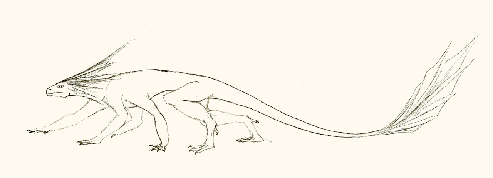

# Hexapede Lizards

*Spina Senilacertus*

May have scales and/or feathers
Toothy maw.

## Winged Lizards
*Spina Senilacertus Aero*

### False Dragons
*Spina Senilacertus Aero Penna*

#### Feathered Serpents

Long tail, vestigial legs, no beak.

#### Seraphim

Four Feathered legs that look like wings in addition to its usual pair, in addition to regular wings

### Drakes
*Spina Senilacertus Aero Minor*

### True Dragons

*Spina Senilacertus Aero Draco*

Dragons are large, warm-blooded lizards with mebranous wings and long necks and tails. They typically have a line of spikes running down their back.

They are functionally immortal unless killed, and grow continously throughouth their life.

Dragons primarily eat large mammillians, especially herd animals like deer or sheep. Dragons to not typically eat humans, but may do so if provoked

See [Dragons](../../../culture/peoples/dragons) for more.

## Salamaders
*Spina Senilacertus Squama*

Soft, leathery scales.
Blunted shape.

### Common Salamander

### Fire Salamander

Immune to all heat. Lives in swamps, and nests in decaying plant matter.
Primrily eats Fire Flies, but will also eat other insects.

### Symbiont Salamander

Stout, wide-bodied salamander that has a symbiotic relation with a plant, which grows out of the lizard, getting nutrients and providing camoflage. 
Subspecies exist that bond with lichens which in turn look like mossy shale, for camoflague in mountainous regions

### Protean

Broad head, strong toothed jaw.
Blunt, flat tail.
Broad thick limbs, with flat, flipper-like paws with vestigial claws.

## Hexapede Lizards
*Spina Senilacertus Pecten*

### Cliffrunner

Long tail, short neck. Wedge-shaped head with a feathered crest
Very powerful hind legs for jumping. Excellent climbers, and capable swimmers.
Front two pairs pof legs join body much nearer each other than the hindlegs
Omnivorous, eats small mammels, lizards, and insects, as well as carrion, berries and roots, and more.
Commonnly found around the edges of the riftscape
	

### Feathered Runner

Smaller Cliffrunner subspecies, with more evently spaced legs. Adept at running and climbing, but do not have the same jumping abilities.
6-10 ft long body, with an additional 8-10 ft tail.

Arid mountain habitat
Omnivorous scavenger. Eats small mammels and insects when it can catch them.

Occasionally used as a mount in mouintainous of forested terraon

### Basilisk

About 40-60 cm long, including tail.				
Potent hypnotic abilities in crest 	
Predatory. Eats lizards and small mammals. Hypnotic abilities allow it to catch prey larger than itself.

### Maned Hexhunter

Rather than the feathered or webbed crests common among other hexepede lizards, head is surrounded by medium-lenght tentacles, which serve several purposes - sensory organs (air/water currents, electromagnetic fields), 
rudimentry gills (only sufficient to allow it to remain underwater for 30-40 minutes), protection for the face and neck, and an extra way to latch onto prey if the bite doesn't quite hit.
Strong, bulky jaw with immense bite force.

About the size of a tiger.

Ambush predator. Hunts solo or in small packs. Amphibuous. Preys on just about anything smaller than it.
Hindlimbs have broad, webbed toes.
Both pairs of forelimbs are more addapted for climbing.

Found in jungles and wooded swampland.

### Mantis Lizard

Walks on only its back two pairs of legs
First pair of forelimbs have large, razor-sharp claws, and are not used for walking.

50-90cm long, hunts mainly small animals.

### Vine Climber

Medium sized hexapede lizard similar to a Symbiont Salamander, except that it hosts hanging vines.
Found only in the Riftscape.
