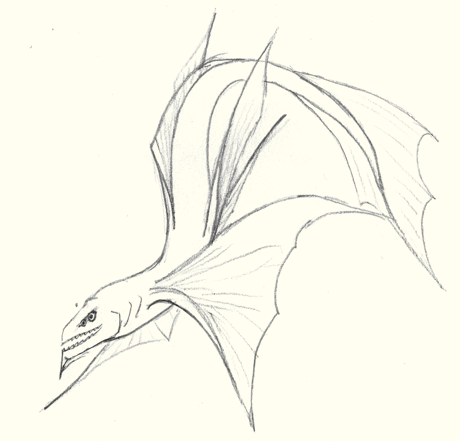

# Serpentfish

4-6 eyes, long flexible body. Some have a bony skeleton, others have a partly or fully cartiligious skeleton.
Typically have 2 pairs of lateral fins, one dorsal fin, one or two belly fins, and a large vertical tail fin.

Strictly aquatic, breathe via gills. Size can range from a couple millimeters long to twenty meters, though these larger species are typically only found in ocean depths. 

Within these constraints, extremely wide range of appearances.
Genetically diverse. While few scholars recognize this, the Serpentfish class should be considered a superclass of all vertebrates on Dael.

## Reproduction

Serpentfish typically reproduce sexually, with a male impregnating a female to produce young.
Parthenogenesis and hermaphroditism have been observed in some species.

Most serpentfish lay large numbers of eggs, and do not care for their young. 

## Species:

### Tentaclefin

Front pair of fins include tentacles ending in suction cups

### Sea Serpent

Longest serpentfish species (though not the most masive)